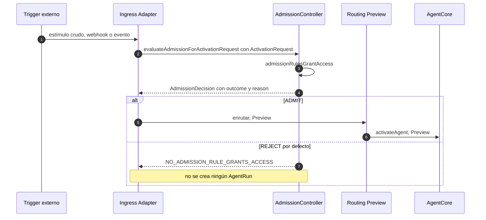
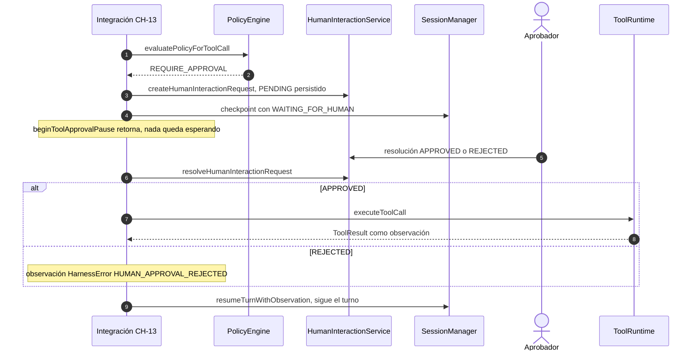
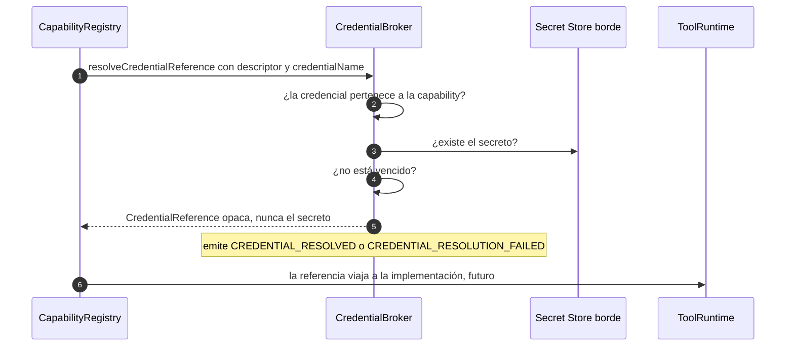
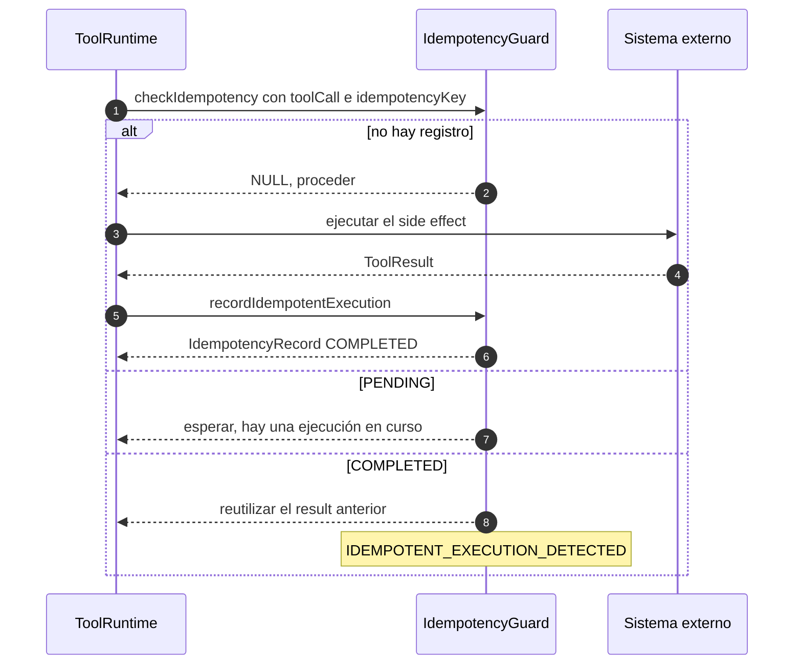
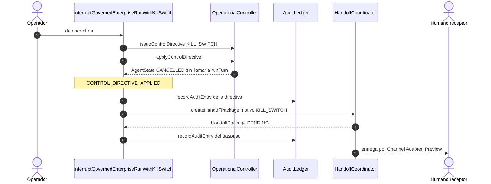
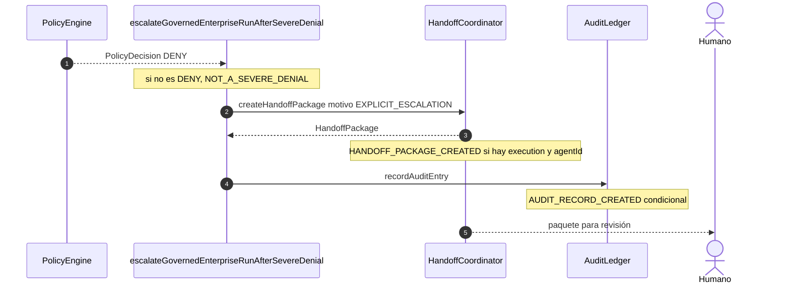
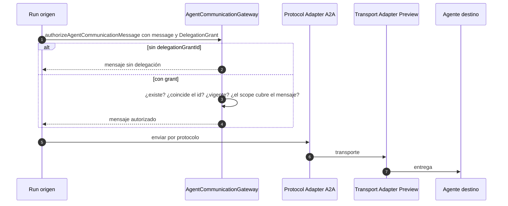
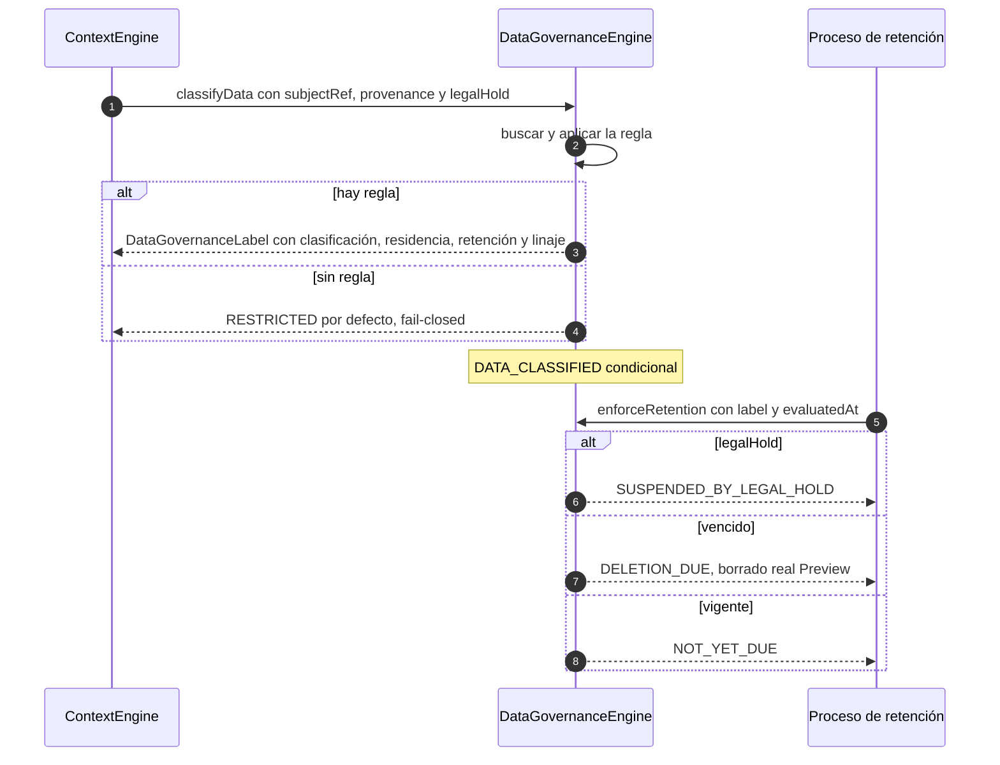
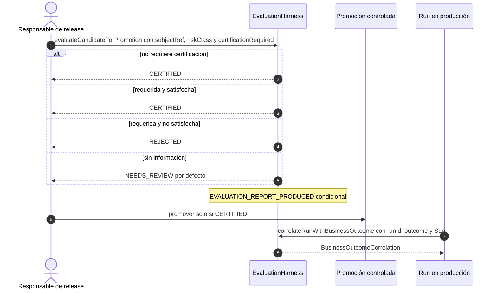
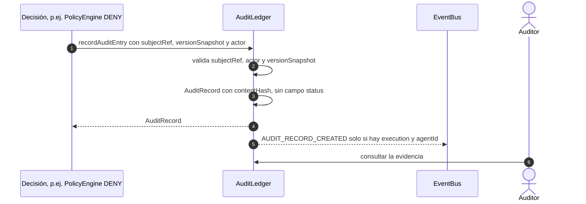

# book-harness — 10 flujos empresariales

[[BH-Arquitectura-y-Flujos]] · [[BH-Implementacion]] · [[BH-Diagramas-Archify]]

Diez escenarios empresariales resueltos con la arquitectura del libro. Cada flujo trae:
- un **diagrama de secuencia numerado**;
- un **paso a paso** con la misma numeración;
- los **componentes** que intervienen;
- **puntos de control**: fallos, límites, y lo que el libro deja como *Preview*.

Los nombres de función son los del pseudocódigo del libro.

> **Importante:** el libro es pseudocódigo. Estos flujos describen **cómo diseñar** cada caso, no un software que se pueda instalar. Lo marcado como **Preview** está anunciado pero no implementado en el libro.
>
> Abreviatura: `chNN` = `repos/aaramirez/book-harness/book/chapters/NN-*/chapter.md`.

| # | Flujo | Componentes | Caso típico |
| --- | --- | --- | --- |
| 1 | Admisión de una activación externa | AdmissionController | Webhook de un cliente, evento de un ERP |
| 2 | Aprobación humana dentro del turno | PolicyEngine + HumanInteractionService | Pago o cambio que necesita un visto bueno |
| 3 | Credencial que nunca ve el modelo | CredentialBroker | Llamar a un CRM con secreto corporativo |
| 4 | Side effect crítico sin duplicados | IdempotencyGuard | Cobro, envío de correo, alta de cuenta |
| 5 | Kill switch con traspaso a humano | OperationalController + HandoffCoordinator + AuditLedger | Incidente: detener un agente ya |
| 6 | Escalamiento tras una denegación grave | PolicyEngine + HandoffCoordinator | Intento de acción prohibida |
| 7 | Delegación acotada entre agentes | AgentCommunicationGateway | Un agente de ventas delega a uno de facturación |
| 8 | Clasificación y retención de datos | DataGovernanceEngine | PII, residencia, legal hold |
| 9 | Certificación antes de promover | EvaluationHarness | Pasar un agente nuevo a producción |
| 10 | Evidencia de auditoría inmutable | AuditLedger | Cumplimiento, investigación de una decisión |

---

## Flujo 1 — Admisión de una activación externa

**Objetivo:** que ningún estímulo externo (webhook, cola, cron) arranque un agente sin que alguien decida explícitamente si puede. Principios P-16 y P-17.

**Paso a paso:**
- **1-2.** El adaptador de entrada normaliza el estímulo en un `ActivationRequest`. El ingreso **nunca** llama a AgentLoop (INV-E01).
- **3-4.** AdmissionController aplica sus reglas. Si ninguna concede acceso, rechaza (fail-closed).
- **5-6.** Con ADMIT se enruta y se activa el agente. En el libro, esta parte es **Preview**.
- **7.** Con REJECT no existe run, y por eso **no se emite ningún evento**: AgentEvent exige un runId.

**Componentes:** `AdmissionController` (CMP-012) y contratos `ActivationRequest` / `AdmissionDecision`.

**Puntos de control:**
- La decisión se audita en el turno gobernado (CH-26 paso 0).
- El rechazo es `recoverable=T`, `retryable=F`.
- Identidad, tenant, capacidad, rate y budget están enunciados en P-17. En el pseudocódigo se reducen a `admissionRulesGrantAccess`.

**Evidencia:**
- `ch14:390-396`: el problema.
- `ch14:827-884`: secuencia y pseudocódigo.
- `ch14:941-946`: rechazo.
- `ch14:972-991`: sin eventos.
- `repos/aaramirez/book-harness/constitution/ARCHITECTURE_CONSTITUTION.md:930-935`: P-16 y P-17.

---

## Flujo 2 — Aprobación humana dentro del turno

**Objetivo:** que una acción con side effect que la política marca como sensible no se ejecute sin una resolución humana válida (INV-15), y que la espera no retenga el turno.

**Paso a paso:**
- **1-2.** La política aplica la regla y exige aprobación.
- **3-4.** Se crea y persiste la solicitud en PENDING, el estado pasa a WAITING_FOR_HUMAN y se hace checkpoint.
- **5.** La función **retorna**: no hay hilo bloqueado, y la reanudación es otra llamada.
- **6-7.** Llega la resolución. `resolveHumanInteractionRequest` protege contra resolver dos veces (`REQUEST_ALREADY_RESOLVED`) y contra un tipo de resultado que no corresponde.
- **8-9.** Si se aprueba, la tool se ejecuta. Si se rechaza, el rechazo vuelve al modelo como observación de error (categoría POLICY).
- **10.** Se retoma la cola compartida del turno.

**Componentes:** `PolicyEngine`, `HumanInteractionService`, `SessionManager` y `ToolRuntime`.

**Puntos de control:**
- La interacción humana es independiente de la interfaz (INV-14): el canal (Slack, web) es un adaptador.
- `resumeAfterHumanResolution` no está cableada en `runAgentTurnEndToEnd`.

**Evidencia:**
- `ch05:728-760`: orden de la política.
- `ch06:847-956`: solicitud y resolución.
- `ch13:867-997`: pausa y reanudación.
- `ch13:1092-1096`: transiciones.

---

## Flujo 3 — Credencial que nunca ve el modelo

**Objetivo:** que una tool use el secreto corporativo correcto sin que este entre en el contexto del modelo ni quede hardcodeado (INV-E08).

**Paso a paso:**
- **1.** Al resolver la capability se pide su credencial por nombre.
- **2-4.** Los chequeos van en orden: primero la **pertenencia**, luego la existencia y luego la vigencia. Validar la pertenencia antes evita filtrar por canal lateral si un secreto existe.
- **5-6.** Se devuelve una referencia opaca y se emite un evento en cualquier rama.
- **7.** La inyección real en la implementación de la tool queda para el futuro.

**Componentes:** `CredentialBroker` (CMP-014).

**Puntos de control:**
- `CREDENTIAL_CAPABILITY_MISMATCH` no es recuperable.
- `CREDENTIAL_NOT_FOUND` y `CREDENTIAL_EXPIRED` son recuperables pero no reintentables.
- Elegir la credencial **no es** autorizar: eso lo sigue haciendo PolicyEngine.

**Evidencia:**
- `ch16:364-386`: el problema.
- `ch16:845-982`: secuencia y pseudocódigo.
- `ch16:992-998`, `ch16:1042-1050`: fallos y orden.
- `ch16:1080-1082`: eventos.

---

## Flujo 4 — Side effect crítico sin duplicados

**Objetivo:** que un reintento o una entrega duplicada no cobre dos veces ni envíe dos correos (INV-11, P-24).

**Paso a paso:**
- **1.** Antes de ejecutar, se consulta la clave de idempotencia.
- **2-6.** Sin registro, se ejecuta y se registra como COMPLETED. Se conservan el id y el `createdAt` de un PENDING previo.
- **7.** Con PENDING hay que esperar. Por eso un booleano no basta.
- **8-9.** Con COMPLETED se devuelve el resultado anterior sin tocar el sistema externo.

**Componentes:** `IdempotencyGuard` (CMP-015).

**Puntos de control:**
- Los registros son de escritura única: `IDEMPOTENCY_RECORD_ALREADY_COMPLETED`.
- `IDEMPOTENCY_KEY_CAPABILITY_MISMATCH` no es recuperable.
- No se emite evento cuando el resultado es NULL.

**Evidencia:**
- `ch17:418-450`: el problema.
- `ch17:927-1085`: secuencia y pseudocódigo.
- `ch17:1166-1174`: fallos.
- `ch17:1208-1224`: eventos.

---

## Flujo 5 — Kill switch con traspaso a humano

**Objetivo:** detener de inmediato un agente en producción **sin depender del loop que se está deteniendo**, dejar evidencia y entregar el caso a una persona con un paquete estructurado (P-30, INV-E14, INV-E12).

**Paso a paso:**
- **1-2.** El operador emite la directiva (ISSUED, sin evento).
- **3-4.** Se aplica: el estado pasa a CANCELLED **sin** `runTurn` ni `evaluateExecutionContinuation`. El primero que llega a un estado terminal gana.
- **5.** La directiva queda auditada.
- **6-7.** Se crea un `HandoffPackage` estructurado (runId, sessionId, motivo, contexto, destinatario), no prosa suelta.
- **8.** El traspaso también se audita.
- **9.** La entrega al humano y las transiciones PENDING→ACCEPTED→COMPLETED son **Preview**.

**Componentes:** `OperationalController`, `AuditLedger` y `HandoffCoordinator`.

**Puntos de control:**
- `KILL_SWITCH_ON_TERMINAL_AGENT_STATE` y `CONTROL_DIRECTIVE_ALREADY_APPLIED` protegen contra dobles aplicaciones.
- DISABLE_CAPABILITY, ISOLATE_TENANT y ROLLBACK existen como tipos pero no emiten eventos.
- Esta función **no** se invoca desde `runGovernedEnterpriseTurn`.

**Evidencia:**
- `ch27:577-650`: pseudocódigo.
- `ch18:1083-1197`, `ch18:1302-1316`: directiva y guardas.
- `ch23:958-1090`: paquete.
- `ch27:510-514`: no cableada.
- Diagrama del libro: `repos/aaramirez/book-harness/diagrams/archify/rendered/capitulo-27-integracion-enterprise-caminos-de-control.html`.

---

## Flujo 6 — Escalamiento tras una denegación grave

**Objetivo:** cuando la política deniega algo grave, además de devolver la negativa al modelo, escalar a un humano con contexto y evidencia.

**Paso a paso:**
- **1-2.** Solo aplica a DENY. Cualquier otra decisión lanza `NOT_A_SEVERE_DENIAL`.
- **3-4.** Se arma un paquete de traspaso con motivo de escalamiento explícito.
- **5.** El escalamiento queda auditado.
- **6.** Un humano recibe el caso.

**Componentes:** `PolicyEngine`, `HandoffCoordinator` y `AuditLedger`.

**Puntos de control:**
- **Qué cuenta como "grave" lo decide quien llama.** `PolicyDecision` no tiene un campo de severidad, así que necesitas tu propio criterio (tipo de regla, capability, tenant).
- En paralelo, la denegación normal vuelve al modelo como observación (`runAgentTurnWithPolicyDenial`, CH-13).

**Evidencia:**
- `ch27:651-672`: pseudocódigo y severidad externa.
- `ch13:808-857`: DENY como observación.

---

## Flujo 7 — Delegación acotada entre agentes

**Objetivo:** que un agente delegue a otro (interno o externo, p.ej. vía A2A) sin acoplarse a su SDK o transporte, y con **autoridad delegada explícita, acotada y con vencimiento** (P-18 a P-21).

**Paso a paso:**
- **1.** Todo mensaje entre agentes cruza una frontera explícita (INV-E03).
- **2-3.** Sin delegación, el mensaje pasa sin autoridad delegada.
- **4-5.** Con delegación se verifican cuatro condiciones: existencia, coincidencia, vigencia (`now() > expiresAt`) y alcance.
- **6-8.** El protocolo y el transporte son adaptadores reemplazables (INV-E04). A2A es opcional (INV-E05).

**Componentes:** `AgentCommunicationGateway` (CMP-013), el **único** componente multi-agente de los 22.

**Puntos de control:**
- Los errores `DELEGATION_GRANT_NOT_FOUND`, `_MISMATCH`, `_EXPIRED` y `DELEGATION_SCOPE_EXCEEDED` son recuperables pero no reintentables.
- La profundidad y el costo de la delegación deben acotarse por ExecutionBudget (INV-E06).
- No hay eventos, porque el mensaje no tiene sessionId.

**Evidencia:**
- `ch15:402-426`: el problema.
- `ch15:940-1031`: secuencia y pseudocódigo.
- `ch15:1100-1112`: fallos.
- `ch15:1140-1158`: sin eventos.
- `ch25:533-546`: CMP-013 es la excepción multi-agente.

---

## Flujo 8 — Clasificación y retención de datos

**Objetivo:** que el dato que entra al contexto o sale de una tool lleve una **etiqueta de gobierno** (clasificación, residencia, retención, linaje) decidida **fuera** del modelo, y que la retención respete un legal hold (P-22, INV-E11).

**Paso a paso:**
- **1-2.** Cada bloque de contexto se clasifica a partir de su procedencia.
- **3-5.** Sin regla aplicable, el dato queda **RESTRICTED** (fail-closed).
- **6-7.** La retención se evalúa aparte: el legal hold tiene prioridad sobre el vencimiento.
- **8-10.** El borrado efectivo es **Preview**.

**Componentes:** `DataGovernanceEngine` (CMP-018).

**Puntos de control:**
- `classifyData` falla (no recuperable) si falta el subjectRef o la procedencia.
- `enforceRetention` nunca falla.
- En el turno gobernado se clasifica cada bloque del contexto (CH-26 pasos 3 y 14).

**Evidencia:**
- `ch20:448-460`: el problema.
- `ch20:1028-1254`: secuencia y pseudocódigo.
- `ch20:1340-1371`: fallos.
- `ch20:1382-1386`: eventos.

---

## Flujo 9 — Certificación antes de promover a producción

**Objetivo:** que un agente, skill o política candidata no llegue a producción sin la certificación que exige su clase de riesgo, y medir después su valor de negocio (P-28, P-29, INV-E13).

**Paso a paso:**
- **1-6.** La evaluación ocurre **antes** de que exista ningún run del candidato. El valor por defecto es NEEDS_REVIEW.
- **7.** La promoción queda condicionada al reporte.
- **8-9.** En producción, cada run puede correlacionarse con su resultado de negocio (valor, SLA, escalamiento humano).

**Componentes:** `EvaluationHarness` (CMP-020).

**Puntos de control:**
- Producción y evaluación son ejecuciones separadas (P-28).
- La certificación "real" (suites, datasets) queda abierta en el libro.

**Evidencia:**
- `ch22:455-466`: el problema.
- `ch22:1148-1323`: secuencia y pseudocódigo.
- `ch22:1394-1432`: fallos y eventos.
- `ch25:778-796`: pendientes antes de orquestar de verdad.

---

## Flujo 10 — Evidencia de auditoría inmutable

**Objetivo:** que cada decisión crítica (admisión, denegación, ejecución, kill switch) deje un **registro de auditoría** distinto de logs y trazas, con versiones exactas y hash de contenido (P-25, INV-19, INV-E10).

**Paso a paso:**
- **1-2.** Todo registro exige qué se decidió, quién lo decidió y **con qué versiones** (agente, política, configuración del modelo).
- **3-4.** El registro es estructuralmente inmutable: tiene hash de contenido y no tiene estado que mutar.
- **5.** El evento es solo una **notificación**; la evidencia es el registro.
- **6.** El auditor consulta el ledger, no la telemetría.

**Componentes:** `AuditLedger` (CMP-017).

**Puntos de control:**
- Faltar el subjectRef, el actor o un snapshot incompleto es un error no recuperable.
- En CH-26 se audita la admisión y la ejecución. En CH-27 se auditan la directiva y el traspaso.

**Evidencia:**
- `ch19:430-441`: el problema.
- `ch19:991-1147`: secuencia y pseudocódigo.
- `ch19:1216-1227`: fallos.
- `ch19:1256-1275`: evento condicional.

---

[[BH-Arquitectura-y-Flujos]] · [[BH-Implementacion]] · [[Matriz-Comparativa]]
