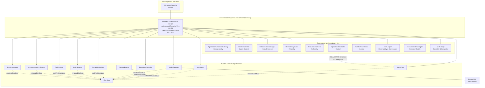
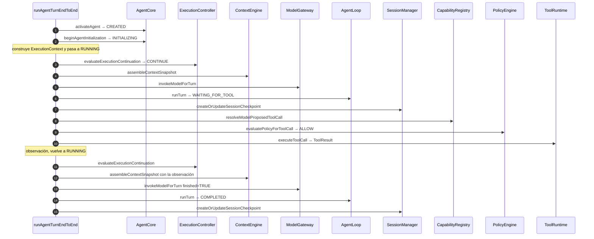
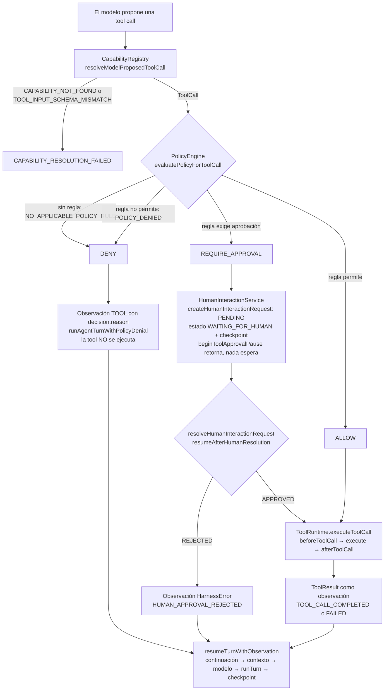
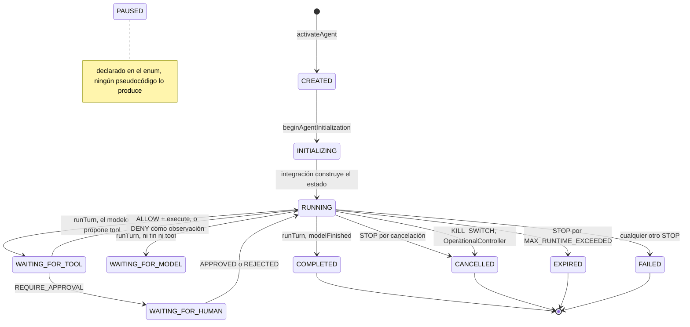
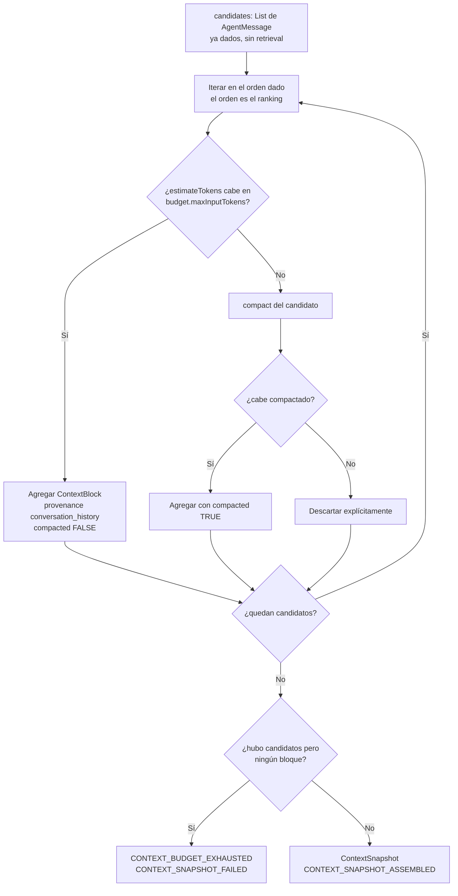
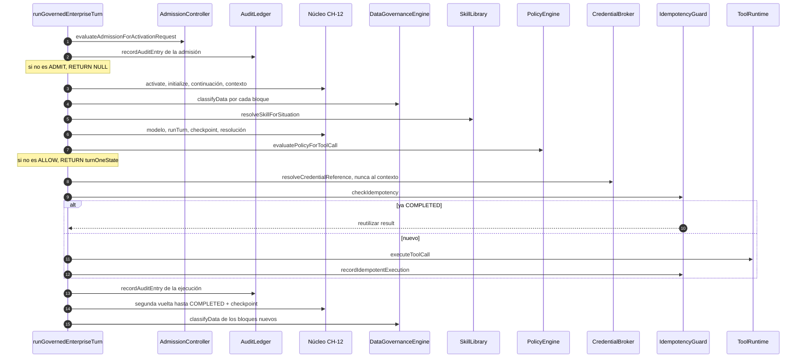
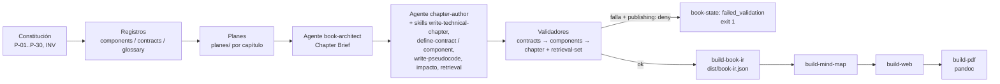

# book-harness — Arquitectura y flujos internos

[[BH-10-Flujos-Empresariales]] · [[BH-Implementacion]] · [[BH-Diagramas-Archify]]

`aaramirez/book-harness` es el libro **"¿Cómo construir un arnés?"**. No contiene código ejecutable del harness: tiene 28 capítulos con **pseudocódigo propio**, una **constitución arquitectónica**, registros canónicos (22 componentes, 35 contratos, 134 términos) y su propio arnés de producción del libro (validadores y build en Node).

Estos diagramas son **vistas transversales**. El libro ya trae 32 diagramas Archify, uno por capítulo más 4 generales, en `repos/aaramirez/book-harness/diagrams/archify/rendered/`. Aquí se referencian, no se duplican.

- **Commit estudiado:** `d16e2c7` (2026-09-20).
- **Abreviatura:** `chNN` = `repos/aaramirez/book-harness/book/chapters/NN-*/chapter.md`.

---

## 1. Mapa de componentes: núcleo + capa enterprise

Hay 11 componentes de núcleo (Article III) y 11 enterprise (Amendment v1.1), agrupados en los planos que el propio libro les asigna. Una decisión clave: **los componentes no se llaman entre sí**. El registro declara `dependencies: []` en todos, y las llamadas ocurren en **funciones de integración** (`runAgentTurnEndToEnd`, `runGovernedEnterpriseTurn`, y otras) que no son componentes.

**Evidencia:**
- `repos/aaramirez/book-harness/constitution/ARCHITECTURE_CONSTITUTION.md:233-352`: los 11 componentes del núcleo.
- `repos/aaramirez/book-harness/constitution/ARCHITECTURE_CONSTITUTION.md:991-1000`: los 9 planos enterprise.
- `ch25:331-342`: componente → plano.
- `repos/aaramirez/book-harness/registry/components.yaml:171`: `dependencies: []`, igual en todos.
- `ch12:701-717`: el registro no se toca a propósito; la integración vive en funciones.

> **Inconsistencias del propio libro:** `registry/components.yaml:101` pone CredentialBroker en "Capability & Integration", y `registry/glossary.yaml:1200-1202` deja EvaluationHarness fuera de los 9 planos. El diagrama sigue `ch25`.

---

## 2. La frontera determinista / agéntica (Article XII)

Regla suprema: *"Probabilistic systems may propose decisions. Deterministic systems must govern consequences."*

```mermaid
flowchart LR
  subgraph AG["Agéntico: el LLM puede"]
    A1["interpretar intención"]
    A2["formar hipótesis"]
    A3["elegir capability"]
    A4["analizar observaciones"]
    A5["proponer siguiente acción"]
    A6["juzgar si el objetivo parece cumplido"]
  end
  B{{"FRONTERA DETERMINISTA"}}
  subgraph DET["Determinista: el runtime controla"]
    D1["identidad y autorización"]
    D2["validación de schema y permisos"]
    D3["budgets, timeouts, retries"]
    D4["idempotencia y sandboxing"]
    D5["aprobaciones y transiciones de estado"]
    D6["auditoría y límites de recursos"]
  end
  RW["Mundo real"]
  AG -- "propone intención" --> B --> DET -- "consecuencias gobernadas" --> RW
```

**Evidencia:**
- `repos/aaramirez/book-harness/constitution/ARCHITECTURE_CONSTITUTION.md:777-840`: Article XII.
- `repos/aaramirez/book-harness/constitution/ARCHITECTURE_CONSTITUTION.md:842-844`: regla suprema.
- `repos/aaramirez/book-harness/constitution/ARCHITECTURE_CONSTITUTION.md:887-924`: doctrina final ("Model proposes; Harness governs…").

---

## 3. Un turno de punta a punta: camino feliz (CH-12)

`runAgentTurnEndToEnd`: dos vueltas del modelo con una tool call permitida en medio. Cada paso emite su evento vía `emitAndDistribute` → `EventBus.distributeEvent`.

**Paso a paso:**
- **1-2.** Nace el `AgentState` (CREATED → INITIALIZING), y la integración lo pasa a RUNNING.
- **3.** ExecutionController decide si se puede continuar. Si no es CONTINUE, se retorna.
- **4-6.** Se arma el contexto, se invoca al modelo y AgentLoop interpreta la respuesta: propone una tool, así que pasa a WAITING_FOR_TOOL.
- **7.** Checkpoint de la sesión.
- **8-10.** Resolución de la capability, decisión de política (si no es ALLOW, se retorna) y ejecución.
- **11-16.** Segunda vuelta con la observación, hasta COMPLETED, más un checkpoint final.

Eventos: `RUN_STARTED`, `EXECUTION_EVALUATED`, `CONTEXT_SNAPSHOT_ASSEMBLED`, `MODEL_RESPONSE_RECEIVED`, `TURN_CONTINUED`, `SESSION_CHECKPOINT_CREATED`, `CAPABILITY_RESOLVED`, `POLICY_EVALUATED`, `TOOL_CALL_COMPLETED`, `RUN_COMPLETED`.

**Evidencia:**
- `ch12:655-676`: orden de invocación.
- `ch12:829-1040`: pseudocódigo.
- `ch12:892-895`, `:952-955`: salidas tempranas.
- `ch12:795-815`: `emitAndDistribute`.
- `ch12:1126-1139`: eventos.
- Diagrama del libro: `repos/aaramirez/book-harness/diagrams/archify/rendered/capitulo-12-integracion-camino-feliz.html`.

---

## 4. Gobierno de una tool call (CH-02, CH-05, CH-06, CH-08, CH-13)

Qué pasa entre "el modelo propone una tool" y "hay una observación". La política evalúa en un **orden fijo** y falla cerrada.

**Evidencia:**
- `ch08:794-860`, `ch08:882-908`: resolución.
- `ch05:514-518`, `ch05:728-760`: outcomes y orden fail-closed.
- `ch06:847-956`: solicitud y resolución humana.
- `ch02:674-764`: ejecución con hooks.
- `ch13:734-997`: cola compartida, DENY, pausa y reanudación.
- `repos/aaramirez/book-harness/constitution/ARCHITECTURE_CONSTITUTION.md:468-498`: Article VI, ruta de ejecución.

> Las cinco funciones de CH-13 **no se llaman** desde `runAgentTurnEndToEnd` (`ch13:643-646`). Son caminos alternativos documentados, no ramas cableadas.

---

## 5. Los 11 estados de un AgentRun

**Evidencia:**
- `repos/aaramirez/book-harness/registry/contracts.yaml:227-247`: C-013, los 11 valores.
- `ch11:796-852`: CREATED e INITIALIZING.
- `ch01:583-589`: `runTurn`.
- `ch13:1089-1101`: DENY, pausa, reanudación y terminación.
- `ch18:1267-1277`: KILL_SWITCH desde cualquier estado no terminal (desde uno terminal lanza error).

> **Hallazgos:** `PAUSED` no tiene transición en ningún pseudocódigo (solo aparece en el enum, `ch00:451`, `ch01:413`). `INITIALIZING → FAILED` figura solo como "Preview" (`ch11:896`). El libro también lo documenta: `repos/aaramirez/book-harness/diagrams/archify/rendered/estados-de-un-run.html`.

---

## 6. Qué ve realmente el modelo: ensamblado de contexto (CH-04)

**Evidencia:**
- `ch04:686-765`: `assembleContextSnapshot`.
- `ch04:478-500`: ContextBlock y ContextSnapshot.
- `ch04:776-792`: sin retrieval y sin filtrado de autorización.

---

## 7. El turno gobernado enterprise (CH-26)

`runGovernedEnterpriseTurn` monta la capa enterprise sobre el camino feliz de CH-12: admisión, gobierno de datos, skill, credencial, idempotencia y auditoría.

**Evidencia:**
- `ch26:621-647`: orden, pasos 0-17.
- `ch26:781-1047`: pseudocódigo.
- `ch26:987-991`: la auditoría ocurre después del if/else, también en la rama de reutilización.
- Diagrama del libro: `repos/aaramirez/book-harness/diagrams/archify/rendered/capitulo-26-integracion-enterprise-camino-feliz.html`.

> Inconsistencias menores del libro: la tabla de §8 ubica la auditoría dentro del `else`, pero el pseudocódigo la pone después del if/else. El §10 pasa `block.provenance` como subjectRef (`ch26:731`, frente a `ch26:885-887`).

---

## 8. Cómo se produce el propio libro (arnés de producción)

El repo aplica su constitución a sí mismo. Agentes, skills, validadores y políticas gobiernan la escritura del libro.

**Evidencia:**
- `repos/aaramirez/book-harness/constitution/ARCHITECTURE_CONSTITUTION.md:8-28`: nota de adopción.
- `repos/aaramirez/book-harness/agents/book-architect.md:3-10`, `repos/aaramirez/book-harness/agents/chapter-author.md:3-8`: agentes.
- `repos/aaramirez/book-harness/scripts/build-all:41-80`: orquestación.
- `repos/aaramirez/book-harness/policies/publishing.yaml:13-14`: `unresolved_validation_errors: deny`.
- `repos/aaramirez/book-harness/scripts/README.md:3-12`: Node sin dependencias.

> Los diagramas Archify y el PDF ejecutivo (`scripts/build-flujos-doc.py`) se generan **fuera** de `build-all`.

---

[[BH-10-Flujos-Empresariales]] · [[BH-Implementacion]] · [[Matriz-Comparativa]]
