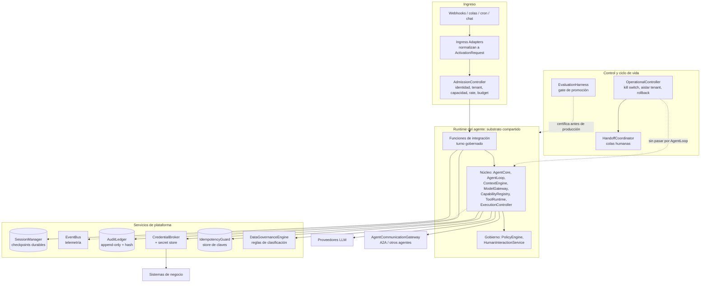
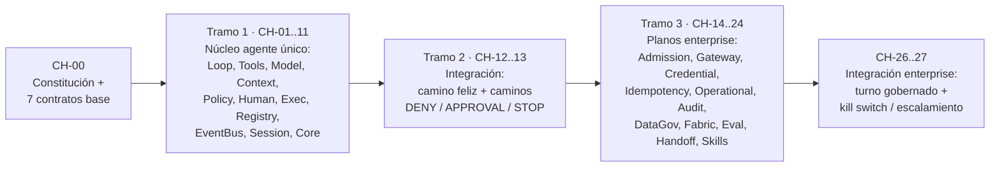
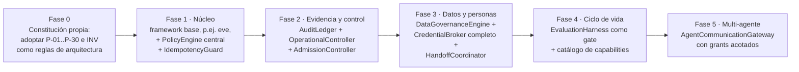

# book-harness — Cómo implementar la arquitectura en una empresa

[[BH-Arquitectura-y-Flujos]] · [[BH-10-Flujos-Empresariales]] · [[BH-Diagramas-Archify]] · [[vercel-eve]] · [[Eve-vs-BookHarness-vs-Pi]] · [[BH-Propuestas]]

**Respuesta corta:** el libro no se instala. Es una **especificación**: constitución, 22 componentes, 35 contratos y pseudocódigo. Implementarlo significa:
1. **construir** los componentes en el orden que el propio libro justifica (CH-25);
2. **elegir tecnología real** para cada uno;
3. **aprovechar un framework existente** para lo que ya resuelve. Con [[vercel-eve]] se cubre buena parte del núcleo, pero casi nada de la capa enterprise de gobierno.

> Convención:
> - **[doc]** = lo dice el libro (`repos/aaramirez/book-harness/...`).
> - **[eve]** = según nuestro estudio de eve.
> - **[inferencia]** = recomendación nuestra.
>
> Abreviatura: `chNN` = `repos/aaramirez/book-harness/book/chapters/NN-*/chapter.md`.

---

## 1. Arquitectura de referencia

**Evidencia:**
- `repos/aaramirez/book-harness/constitution/ARCHITECTURE_CONSTITUTION.md:926-1000`: Amendment v1.1 y los planos.
- `ch26:621-647`: el turno gobernado.
- `repos/aaramirez/book-harness/constitution/ARCHITECTURE_CONSTITUTION.md:147`: P-15, substrato compartido.

---

## 2. Orden de construcción: lo que prescribe el libro (CH-25)

El principio rector es **P-09: la confiabilidad de un solo agente precede a la complejidad multi-agente**. 21 de los 22 componentes son de un solo agente; solo `AgentCommunicationGateway` es multi-agente, y llega en el capítulo 15 de 26.

**Evidencia:**
- `ch25:268-270`: P-09.
- `ch25:312-343`: el orden.
- `ch25:421-445`: la justificación (P-06, P-15).
- `ch25:533-546`: CMP-013 es la única excepción.

> El propio libro lista lo que **queda abierto** antes de orquestar de verdad (`ch25:778-796`). Hay 9 puntos de cableado pendientes, entre ellos: que la admisión llame a `activateAgent`, que el Gateway se invoque desde el flujo end-to-end, y que CredentialBroker actúe dentro de ToolCall. También quedan pendientes los mecanismos de registro, la certificación real, el handoff real y la ejecución real de skills.

---

## 3. Los 22 componentes: tecnología sugerida y cobertura de eve

Leyenda de "¿Lo cubre eve?":
- **✔**: nativo;
- **◐**: parcial, hay que extenderlo;
- **✖**: no existe, hay que construirlo.

La columna de eve sale de [[vercel-eve]]. La de tecnología es **[inferencia]**.

| # | Componente | Responsabilidad [doc] | ¿Lo cubre eve? [eve] | Tecnología sugerida [inferencia] |
| --- | --- | --- | --- | --- |
| 1 | AgentCore | primitivas del agente, sin UI ni persistencia | ✔ `defineAgent` + sesión | — |
| 2 | AgentLoop | ciclo modelo → acción → observación | ✔ 1 llamada por paso, durable | — |
| 3 | ModelGateway | selección, adaptación, streaming y normalización | ✔ Vercel AI SDK / AI Gateway | LiteLLM o gateway propio si hay varios proveedores |
| 4 | ContextEngine | selección, ranking, compactación, budget, **provenance** | ◐ hay compactación; ranking y provenance no | Capa de retrieval (pgvector, OpenSearch) con procedencia por bloque |
| 5 | ToolRuntime | valida, hooks before/after, ejecuta, normaliza | ✔ `defineTool`, errores como datos | — |
| 6 | PolicyEngine | allow / deny / aprobación con reglas deterministas | ◐ `approval` por tool; sin motor central de reglas | OPA/Rego o Cedar, fail-closed |
| 7 | SessionManager | checkpoints, reconstrucción, **branching** | ◐ sesión durable en Workflow; sin branching | Postgres (world) + checkpoints versionados |
| 8 | HumanInteractionService | solicitudes persistidas, resolución y reanudación | ✔ `input.requested` / `inputResponses` | — |
| 9 | EventBus | distribución desacoplada de eventos | ✔ stream NDJSON, hooks, OTel | Kafka o NATS si hay muchos consumidores |
| 10 | ExecutionController | budgets, cancelación, deadlines | ◐ caps de tokens y costo, timeout; sin maxSteps | Límites por turno y tenant en la capa de integración |
| 11 | CapabilityRegistry | intención → implementación | ◐ descubrimiento por archivos + `connection_search` | Catálogo de capabilities versionado (P-26) |
| 12 | AdmissionController | admisión antes de ejecutar | ◐ route auth + IP allow-list; sin capacidad, rate ni budget | API gateway (rate limit) + servicio de admisión |
| 13 | AgentCommunicationGateway | frontera entre agentes, grants acotados | ◐ remote agents + `trustedForwarders`; sin grant con scope y vencimiento | Grants firmados (JWT con scope/exp) + adaptador A2A |
| 14 | CredentialBroker | referencia opaca, nunca en el contexto | ✔/◐ `getToken`, conexiones y brokering en sandbox | Vault / AWS Secrets Manager + tokens de corta vida |
| 15 | IdempotencyGuard | PENDING / COMPLETED por clave | ✖ solo hay `operationId` al crear la sesión; las tools son responsables | Tabla de idempotencia (Postgres/Redis) con estados |
| 16 | OperationalController | kill switch fuera del loop, aislar tenant, rollback | ◐ `cancel` / `reset` por sesión; sin kill switch global | Servicio de control + feature flags |
| 17 | AuditLedger | evidencia inmutable, distinta de la telemetría | ✖ OTel y Agent Runs son telemetría, no auditoría (P-25) | Almacenamiento append-only (QLDB, tabla inmutable con hash encadenado, WORM S3) |
| 18 | DataGovernanceEngine | clasificación, residencia, retención, legal hold | ✖ solo `audience` para capturar trazas | Catálogo de datos (DLP, etiquetas) + motor de retención |
| 19 | ExecutionFabricAdapter | topología independiente de la semántica | ✔/◐ Vercel o self-host con la misma definición | Kubernetes / ECS con placement por residencia |
| 20 | EvaluationHarness | certificación antes de promover | ◐ `eve eval`; sin gate de certificación por riesgo | Evals en CI como gate + registro de certificaciones |
| 21 | HandoffCoordinator | paquete estructurado hacia un humano | ✖ | Integración con la mesa de ayuda (ServiceNow, Jira SM, Zendesk) |
| 22 | SkillLibrary | procedimientos consultables, no acciones | ✔ skills + `load_skill` | — |

**Evidencia:**
- Libro: `repos/aaramirez/book-harness/constitution/ARCHITECTURE_CONSTITUTION.md:253-352` (núcleo) y los `ch14`..`ch24` (enterprise).
- eve: `repos/vercel/eve/docs/concepts/execution-model-and-durability.mdx:6-16`, `repos/vercel/eve/docs/tools/human-in-the-loop.md:170-190`, `repos/vercel/eve/docs/guides/auth-and-route-protection.md:299` y `repos/vercel/eve/docs/channels/eve.mdx:64-79`.

**Lectura del cuadro:** eve resuelve casi todo el **núcleo de agente único** (tramos 1–2 del libro). La **capa de gobierno enterprise** (tramo 3) está mayormente abierta. Hay que construir desde cero IdempotencyGuard, AuditLedger, DataGovernanceEngine y HandoffCoordinator, y ampliar mucho PolicyEngine, AdmissionController, OperationalController y AgentCommunicationGateway.

---

## 4. Qué te falta construir, por prioridad

Ordenado según el libro (P-09: primero la confiabilidad de un solo agente) y según el riesgo empresarial **[inferencia]**:

1. **PolicyEngine central y fail-closed** (INV-06, P-13). Toda acción con side effect pasa por reglas deterministas externas al modelo.
2. **IdempotencyGuard** (INV-11, P-24), antes de exponer cualquier tool que cobre, envíe o cree algo.
3. **AuditLedger** (P-25, INV-19, INV-E10): evidencia inmutable con las versiones exactas de agente, política y modelo.
4. **AdmissionController** (P-17, INV-E02): ninguna ejecución sin decisión de admisión, con tenant, capacidad y budget.
5. **CredentialBroker** completo (INV-E08): secretos solo por referencia opaca.
6. **OperationalController** (P-30, INV-E14): un kill switch independiente del loop y aislamiento por tenant.
7. **DataGovernanceEngine** (P-22, INV-E11): clasificación fail-closed y retención con legal hold.
8. **HandoffCoordinator** (INV-E12): traspaso estructurado a la mesa de ayuda.
9. **EvaluationHarness como gate** (P-28, INV-E13): certificación por clase de riesgo antes de producción.
10. **AgentCommunicationGateway** (P-19 a P-21), **al final**: solo cuando lo anterior esté validado.

---

## 5. Plan de implementación sugerido

**Checklist antes de producción** (derivado de las invariantes del libro):
- [ ] Ningún componente central depende de la API directa de un proveedor (INV-01).
- [ ] El modelo nunca es fuente de autorización (INV-03, P-13).
- [ ] Toda tool call se valida y pasa por el runtime (INV-04, INV-05).
- [ ] Todo side effect pasa por política (INV-06) y declara idempotencia (INV-11, INV-E09).
- [ ] Todo run tiene límites explícitos y se puede cancelar (INV-09, INV-10).
- [ ] Un run durable se puede reconstruir desde el estado persistido (INV-13).
- [ ] Ninguna acción que requiera aprobación corre sin una resolución válida (INV-15).
- [ ] Toda decisión crítica es trazable a actor, contexto y política (INV-19), con evidencia de auditoría separada de la telemetría (P-25).
- [ ] Ninguna ejecución ocurre sin una decisión de admisión (INV-E02).
- [ ] Credenciales fuera del contexto del modelo (INV-E08).
- [ ] Datos, memoria, credenciales y auditoría aislados por tenant (INV-E07).
- [ ] El kill switch no depende de AgentLoop (INV-E14).
- [ ] Certificación obligatoria según la clase de riesgo (INV-E13).

**Evidencia:**
- `repos/aaramirez/book-harness/constitution/ARCHITECTURE_CONSTITUTION.md:153-229`: INV-01..20.
- `repos/aaramirez/book-harness/constitution/ARCHITECTURE_CONSTITUTION.md:975-989`: INV-E01..E14.

---

[[BH-Arquitectura-y-Flujos]] · [[vercel-eve]] · [[Matriz-Comparativa]]
