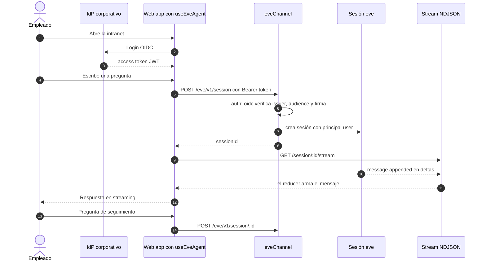
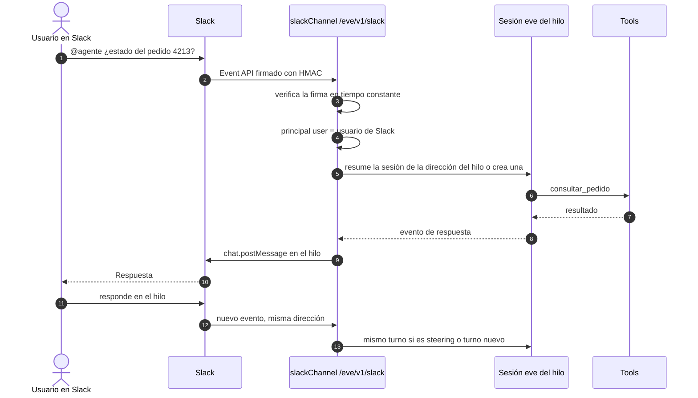
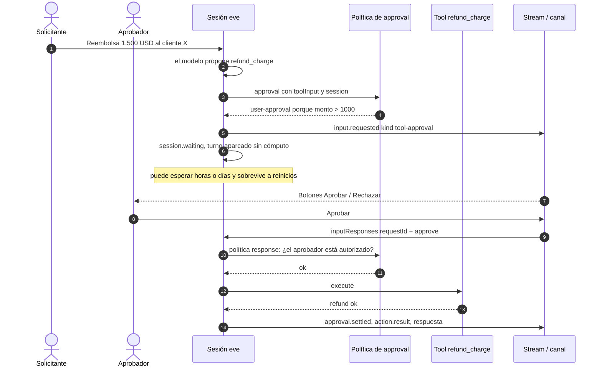
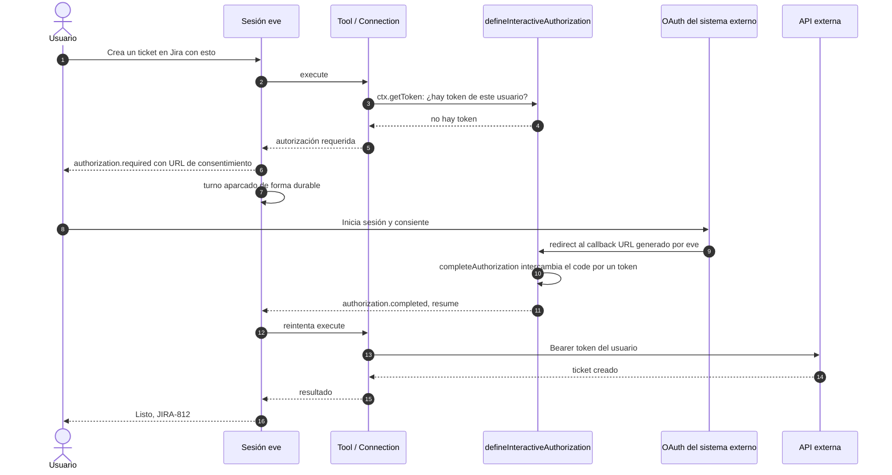
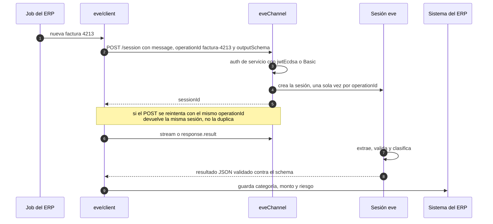
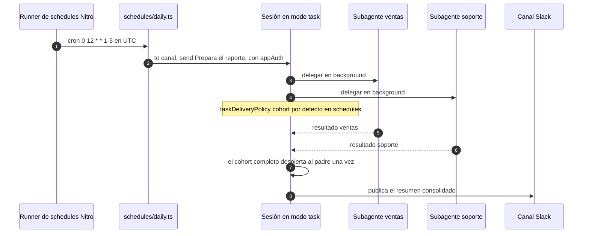
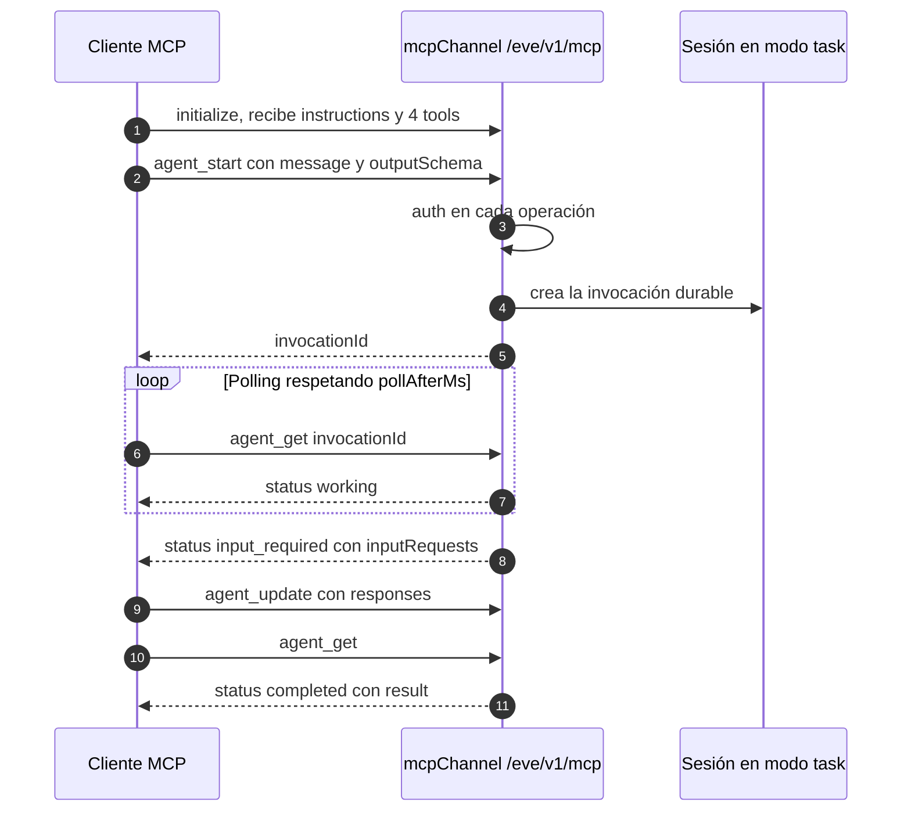
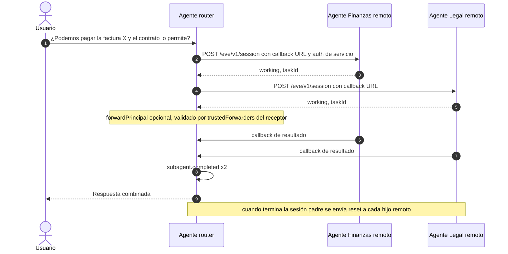
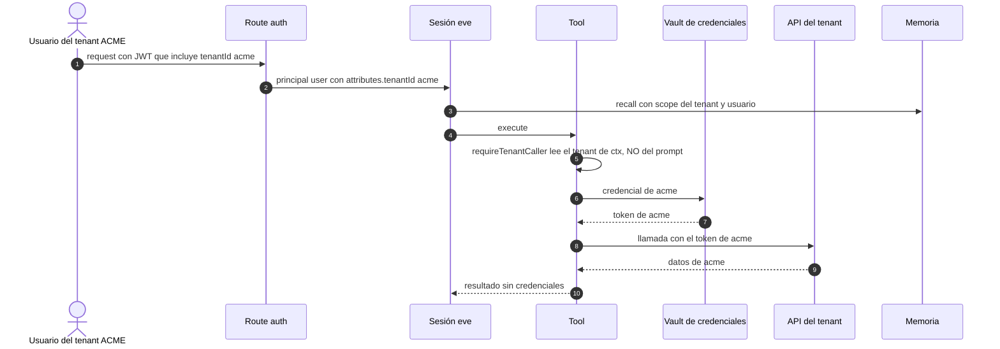
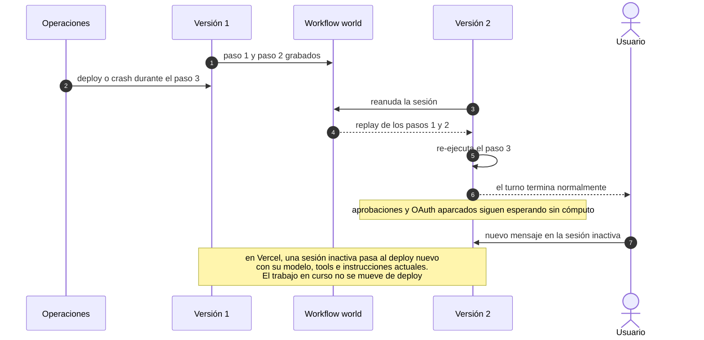

# eve — 10 flujos empresariales

[[vercel-eve]] · [[Eve-Arquitectura-y-Flujos]] · [[Eve-Implementacion-Self-Hosted]]

Los diez patrones de uso empresarial más comunes con eve. Cada uno trae:
- un **diagrama de secuencia numerado**;
- un **paso a paso** cuyos números coinciden con los del diagrama;
- **qué archivos configurar**;
- **puntos de control** (los fallos típicos).

Los flujos se pueden combinar. Por ejemplo, el 2 (Slack) casi siempre incluye el 3 (aprobación) y el 9 (multi-tenant).

| # | Flujo | Canal / mecanismo | Caso típico |
| --- | --- | --- | --- |
| 1 | Chat web interno con SSO | eve HTTP + `useEveAgent` + `oidc()` | Asistente de RR.HH., soporte interno |
| 2 | Asistente en Slack / Teams | Canal de plataforma | Mesa de ayuda IT, consultas de ventas |
| 3 | Aprobación humana de una acción sensible | `approval` + HITL | Reembolsos, altas de usuarios, cambios en producción |
| 4 | OAuth por usuario a un sistema externo | `defineInteractiveAuthorization` | Actuar en CRM o Jira como el usuario |
| 5 | Integración backend a backend | `eve/client` + `operationId` + `outputSchema` | Clasificar tickets o facturas desde un ERP |
| 6 | Reporte programado | `defineSchedule` + subagentes | Resumen diario de ventas o incidentes |
| 7 | Agente como servicio MCP | Canal MCP | Exponer el agente a otros agentes o IDEs |
| 8 | Router multi-agente por dominio | `defineRemoteAgent` | Un agente frontal que delega a Finanzas, Legal e IT |
| 9 | Multi-tenant seguro | `tenantId` en la auth + credenciales por tenant | SaaS B2B, holding con varias empresas |
| 10 | Recuperación ante fallos y redeploys | Workflow durable | Continuidad operacional |

---

## Flujo 1 — Chat web interno con SSO corporativo

**Objetivo:** que los empleados conversen con el agente desde una web interna usando su login corporativo (Entra ID, Okta, Keycloak).



**Paso a paso:**
- **1-3.** La web autentica al empleado con tu IdP y obtiene un JWT. Esto no es parte de eve.
- **4-5.** `useEveAgent` envía el mensaje con `Authorization: Bearer <token>`.
- **6.** `agent/channels/eve.ts` verifica el token: `eveChannel({ auth: [oidc({ issuer, audiences, discoveryUrl }), localDev()] })`.
- **7-8.** Se crea la sesión; `principalId` y los atributos (email, depto) quedan en `ctx.session.auth`.
- **9-12.** La UI consume el stream NDJSON; el reducer de `useEveAgent` convierte los eventos en mensajes.
- **13-14.** El seguimiento va a la misma sesión por su ID, con historial durable.

**Configurar:**
- `agent/channels/eve.ts` (auth + `cors` si la web está en otro origen);
- `useEveAgent({ host })` en el frontend.

**Puntos de control:**
- Quita `placeholderAuth()` antes de producción.
- La route auth **no** verifica que el sesión-ID pertenezca a ese usuario. Guarda el mapeo usuario→sesión en tu app (o en un proxy delante de eve), o compara `ctx.session.auth.initiator` con `auth.current` dentro de las tools sensibles.
- `audience` pasa a `private` para usuarios autenticados, así que las trazas no capturan contenido por defecto.

**Evidencia:**
- `repos/vercel/eve/docs/guides/auth-and-route-protection.md:86-99`: verificadores.
- `repos/vercel/eve/docs/channels/eve.mdx:136-157`: CORS.
- `repos/vercel/eve/docs/guides/auth-and-route-protection.md:267`: sin control de propiedad de sesión.
- `repos/vercel/eve/packages/eve/src/react/use-eve-agent.ts:136`: `useEveAgent`.

---

## Flujo 2 — Asistente en Slack o Microsoft Teams

**Objetivo:** que los usuarios mencionen al agente en un canal o DM y reciban la respuesta en el mismo hilo.



**Paso a paso:**
- **1-2.** Slack envía el evento a `https://tu-agente/eve/v1/slack`.
- **3.** El canal verifica `SLACK_SIGNING_SECRET` y rechaza firmas inválidas antes de que lleguen a la sesión.
- **4.** Los canales de plataforma adjuntan un **principal user** del remitente, así que ya sirve para OAuth por usuario (flujo 4).
- **5.** La "dirección" del hilo mapea a una sesión durable: cada hilo es una conversación.
- **6-10.** El agente ejecuta y el canal publica en el hilo. Las aprobaciones HITL aparecen como botones.
- **11-13.** Las respuestas en el hilo continúan la misma sesión.

**Configurar:**
- `eve add channel/slack`;
- fuera de Vercel, usa "portable credentials": `SLACK_BOT_TOKEN` y `SLACK_SIGNING_SECRET`;
- scopes `app_mentions:read`, `chat:write` e `im:history`;
- Request URL `/eve/v1/slack` para eventos, interactividad y slash commands.

Teams funciona igual: Bot Framework Activity y Adaptive Cards para HITL.

**Puntos de control:**
- La URL pública debe ser accesible desde Slack.
- Incluye en las instrucciones el aviso de que el usuario habla con una IA, si la ley lo exige.

**Evidencia:**
- `repos/vercel/eve/docs/channels/slack.mdx:50-63`: credenciales propias.
- `repos/vercel/eve/docs/concepts/security-model.md:60-72`: verificación de firma.
- `repos/vercel/eve/docs/guides/auth-and-route-protection.md:318`: principal user en canales de plataforma.
- `repos/vercel/eve/docs/channels/teams.mdx:82`: HITL en Teams.

---

## Flujo 3 — Aprobación humana de una acción sensible

**Objetivo:** que ninguna acción irreversible (reembolso, alta de usuario, deploy) se ejecute sin que una persona autorizada la apruebe.



**Paso a paso:**
- **1-2.** El modelo decide llamar a la tool.
- **3-4.** Tu política decide: `approved`, `denied`, `user-approval` o `not-applicable`. **El modelo no autoriza.**
- **5-7.** eve emite `input.requested` y el turno queda en pausa de forma durable.
- **8-10.** El canal muestra los botones (Slack, Teams) o tu UI lee `inputResponses`.
- **11-12.** La política `response` valida **quién** respondió. Sin ella, la aprobación falla cerrada.
- **13-15.** Se ejecuta la tool y el turno continúa exactamente donde estaba.

**Configurar:** `approval` en la tool.

```ts
approval: ({ session, toolInput }) =>
  (toolInput?.amount ?? 0) > 1000 ? "user-approval" : "not-applicable"
```

Si no, usa `always()`, `once()` o `auto()` (con modelo evaluador).

**Puntos de control:**
- Si omites `approval`, equivale a `never()`: la tool se ejecuta sin preguntar.
- Un texto no relacionado **no** cuenta como rechazo; la aprobación sigue pendiente.
- `auto()` envía el input de la tool a un proveedor de evaluación externo. Revisa si eso es aceptable con tus datos.

**Evidencia:**
- `repos/vercel/eve/docs/tools/human-in-the-loop.md:14-83`: approvals.
- `repos/vercel/eve/docs/tools/human-in-the-loop.md:170-190`: pausa y reanudación.
- `repos/vercel/eve/packages/eve/src/harness/approval-delivery-coordinator.ts:368-377`: sin política de respuesta falla cerrada.

---

## Flujo 4 — OAuth por usuario a un sistema externo

**Objetivo:** que el agente actúe en el CRM, Jira o Salesforce **como el usuario**, con los permisos de ese usuario, sin compartir una cuenta de servicio.



**Paso a paso:**
- **1-5.** La tool pide el token del usuario actual; `principalType` debe ser `user`.
- **6-7.** eve emite `authorization.required` y aparca el turno.
- **8-11.** El usuario consiente. El proveedor redirige al callback que generó eve, y tu código intercambia el code por el token.
- **12-16.** La tool se reintenta con el token. El modelo **nunca** ve el token.

**Configurar:**
- En Vercel: `connect("jira/miagente")` con Vercel Connect.
- **Fuera de Vercel:** `defineInteractiveAuthorization` con `startAuthorization` y `completeAuthorization`, más **tu propio almacenamiento cifrado de tokens y refresh**.

**Puntos de control:**
- La sesión debe tener un principal user verificado (flujo 1 o 2). Las sesiones anónimas o de servicio fallan de inmediato.
- Si recibes un 401 aguas abajo, llama a `ctx.requireAuth(provider)` para re-autorizar.

**Evidencia:**
- `repos/vercel/eve/docs/connections/overview.mdx:236-270`: OAuth self-hosted.
- `repos/vercel/eve/docs/guides/auth-and-route-protection.md:273`: requiere principal user.
- `repos/vercel/eve/docs/connections/overview.mdx:206`: `authorization.required` y resume.

---

## Flujo 5 — Integración backend a backend (ERP, CRM, colas)

**Objetivo:** que un sistema interno envíe trabajo al agente y reciba un resultado **estructurado**, con reintentos seguros.



**Paso a paso:**
- **1-2.** Usa `client.sessions.create({ message, ... })`. `operationId` da semántica create-once para el principal autenticado.
- **3.** La auth de servicio devuelve un principal `service` (`httpBasic`, `jwtHmac` o `jwtEcdsa`).
- **4-7.** Los reintentos no duplican el trabajo.
- **8-9.** `outputSchema` fuerza una salida estructurada que tu backend consume sin parsear texto.
- **10.** Tu sistema persiste el resultado.

**Configurar:**
- Un `Client` con `auth: { bearer: async () => token }` y `redirect: "manual"`.
- Un authenticator de servicio en `channels/eve.ts`.

**Puntos de control:**
- `operationId` no funciona con llamantes anónimos.
- Varios requests simultáneos pueden devolver candidatos distintos; reintenta para obtener el ID canónico.

**Evidencia:**
- `repos/vercel/eve/docs/channels/eve.mdx:64-79`: `operationId`.
- `repos/vercel/eve/docs/guides/client/overview.mdx:48-102`: auth del cliente.
- `repos/vercel/eve/docs/guides/client/output-schema.mdx`: salida estructurada.

---

## Flujo 6 — Reporte programado con subagentes

**Objetivo:** que cada mañana el agente recolecte datos de varias fuentes en paralelo y publique un resumen.



**Paso a paso:**
- **1.** El cron es de 5 campos, en UTC. En self-hosting lo dispara el runner de Nitro que arranca `eve start`.
- **2.** La forma `markdown` es un prompt que se dispara y se olvida. La forma `run` es un handler con `to(...)` y `appAuth`.
- **3-6.** Los subagentes corren en paralelo, cada uno con su propio contexto. El presupuesto de tokens se reparte entre ellos.
- **7-8.** Con `cohort`, el padre recibe todos los resultados juntos y publica una sola vez.

**Configurar:**
- `agent/schedules/daily.ts`;
- `agent/subagents/ventas/agent.ts` y `agent/subagents/soporte/agent.ts`.

**Puntos de control:**
- Un host propio que solo sirve HTTP no dispara los crons: hay que llamarlos desde un scheduler externo.
- Con varias réplicas, verifica que el cron no se dispare más de una vez. **La doc no lo aclara; es inferencia.**
- Considera `approval` para los turnos que dispara un schedule.

**Evidencia:**
- `repos/vercel/eve/docs/schedules.mdx:10-33`: `defineSchedule`.
- `repos/vercel/eve/docs/schedules.mdx:150-156`: hosts propios.
- `repos/vercel/eve/packages/eve/src/tasks/delivery-policy.ts:35-58`: `auto` / `cohort`.
- `repos/vercel/eve/packages/eve/src/subagents/token-budget.ts:18-38`: reparto del presupuesto.

---

## Flujo 7 — Agente expuesto como servidor MCP

**Objetivo:** que otras herramientas (Claude, IDEs, otros agentes) deleguen trabajo durable a tu agente vía MCP.



**Paso a paso:**
- **1.** El servidor anuncia `agent_start`, `agent_get`, `agent_update` y `agent_cancel`, junto con instrucciones del protocolo.
- **2-5.** Una vez que `agent_start` responde, el trabajo es durable: aunque se corte la conexión, **no se cancela**.
- **6-8.** El cliente consulta el estado con polling.
- **9-12.** Si hace falta input humano, se envía el batch completo de respuestas.

**Configurar:** `agent/channels/mcp.ts` con `mcpChannel({ auth: ... })`. La auth es obligatoria incluso en desarrollo.

**Puntos de control:**
- `agent_start` **no es idempotente**: si se pierde la respuesta, reintentar crea una segunda tarea.
- Con auth, cada invocación pertenece al principal que la creó.
- Con `none()`, el `invocationId` funciona como capability: no lo pongas en logs.

**Evidencia:**
- `repos/vercel/eve/docs/channels/mcp.mdx:165-218`: invocación, durabilidad y propiedad.

---

## Flujo 8 — Router multi-agente por dominio

**Objetivo:** que un agente frontal atienda al usuario y delegue a agentes especialistas (Finanzas, Legal, IT), cada uno desplegado y gobernado por su propio equipo.



**Paso a paso:**
- **1-5.** Para el modelo, cada agente remoto es una tool más. eve inicia una sesión en el remoto y le pasa una URL de callback.
- **6.** Si `forwardPrincipal: true`, el remoto ve al usuario original, pero **solo** si su `trustedForwarders` acepta al router.
- **7-9.** Los resultados llegan por callbacks durables.
- **10-11.** Al cerrar la sesión padre, eve limpia las sesiones hijas.

**Configurar:**
- En el router: `agent/subagents/finanzas/agent.ts` con `defineRemoteAgent({ url, auth, headers })`.
- En cada especialista: `channels/eve.ts` con auth que acepte al router y `trustedForwarders`.

**Puntos de control:**
- Fuera de Vercel no hay OIDC entre deploys. Usa JWT de servicio o headers.
- El transporte por defecto entre agentes del mismo workspace requiere Vercel; hay que configurar un `transport` explícito.

**Evidencia:**
- `repos/vercel/eve/docs/guides/remote-agents.md:185-201`: dispatch y callbacks.
- `repos/vercel/eve/docs/guides/auth-and-route-protection.md:224-246`: `trustedForwarders`.
- `repos/vercel/eve/docs/subagents/index.mdx:126-141`: transporte explícito.

---

## Flujo 9 — Multi-tenant seguro

**Objetivo:** que un solo agente sirva a varias empresas o unidades de negocio sin mezclar datos, credenciales ni memoria.



**Paso a paso:**
- **1-2.** El `tenantId` sale **solo** de la auth verificada, nunca del prompt, de argumentos de tools ni de respuestas de APIs.
- **3.** La memoria se asocia al scope del tenant y del usuario.
- **4-8.** La tool elige la credencial del tenant a partir de `ctx`. Las connections MCP y OpenAPI aceptan `auth` como función asíncrona de `ctx`.
- **9.** El modelo nunca ve las credenciales.

**Configurar:**
- Un `AuthFn` que devuelva `attributes.tenantId`;
- un helper `requireTenantCaller(ctx)`;
- `auth: async (ctx) => ...` en las connections;
- políticas de approval por tenant.

**Puntos de control:**
- Esta es **la brecha principal**: eve no aplica propiedad de sesión. Si un usuario de otro tenant conoce un `sessionId`, la route auth lo deja pasar. Controla el mapeo sesión→usuario/tenant en tu app o en un proxy delante de eve, y en las tools sensibles compara `ctx.session.auth.initiator` con `auth.current`.

**Evidencia:**
- `repos/vercel/eve/docs/patterns/multi-tenant-auth.md:14-37`: el tenant sale de la auth.
- `repos/vercel/eve/docs/patterns/multi-tenant-memory.md:14`: memoria con scope del tenant.
- `repos/vercel/eve/docs/patterns/multi-tenant-approvals.md:19`: aprobaciones por tenant.
- `repos/vercel/eve/docs/guides/auth-and-route-protection.md:256-267`: `initiator` / `current` y sin ACL.

---

## Flujo 10 — Recuperación ante fallos y redeploys

**Objetivo:** que un corte o un deploy no pierda las conversaciones ni duplique acciones.



**Paso a paso:**
- **1-5.** Los pasos completados no se re-ejecutan. El paso interrumpido sí, **completo**.
- **6-7.** Las esperas largas (aprobaciones, OAuth) sobreviven porque no retienen cómputo.
- **8.** El handoff de sesiones inactivas al deploy nuevo está documentado **para Vercel producción**. En self-hosting, la reanudación depende de que el world persistido sea compartido o sobreviva al reemplazo del contenedor.

**Configurar:**
- En self-hosting, un volumen persistente para `.eve/.workflow-data` o `@workflow/world-postgres`;
- tools con efectos idempotentes (clave de idempotencia hacia la API) o con `approval: always()`.

**Puntos de control:**
- Un consumidor del stream ve ambos intentos del paso re-ejecutado, con ids distintos.
- No hay rollback transparente al modelo de ejecución anterior.

**Evidencia:**
- `repos/vercel/eve/docs/concepts/execution-model-and-durability.mdx:26-30`: handoff.
- `repos/vercel/eve/docs/concepts/execution-model-and-durability.mdx:94-116`: resume y parked work.
- `repos/vercel/eve/docs/guides/deployment/self-hosting.md:27-29`: persistir el world.

---

[[vercel-eve]] · [[Eve-Implementacion-Self-Hosted]] · [[Matriz-Comparativa]]
