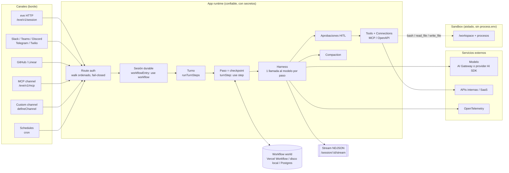
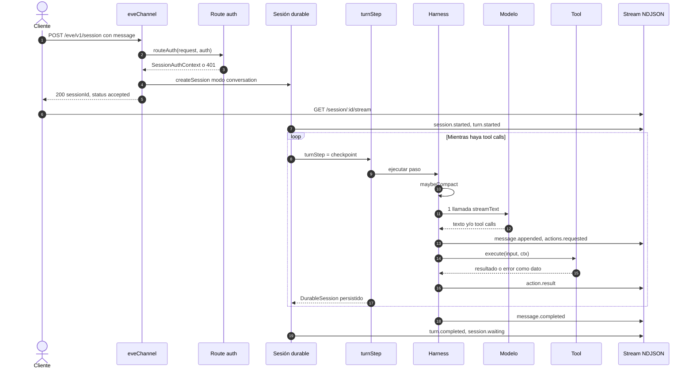
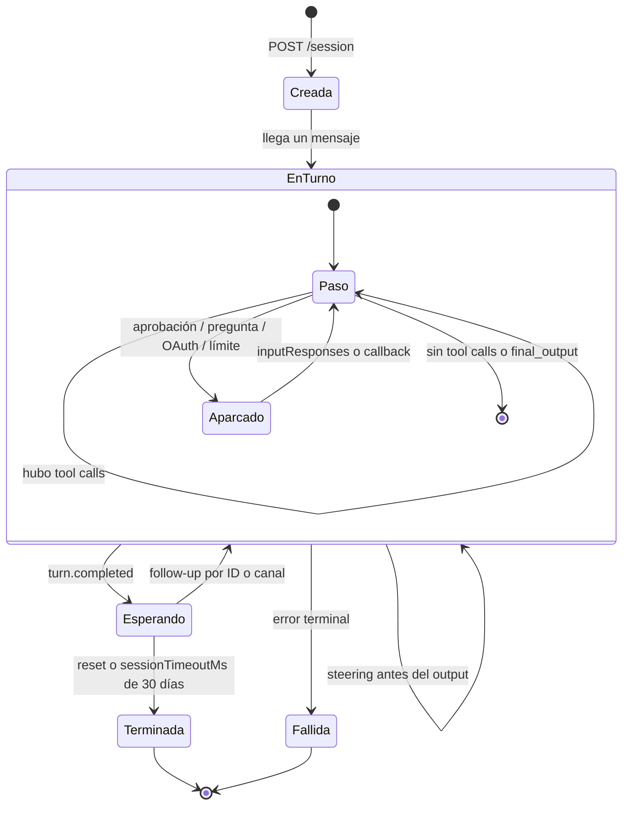
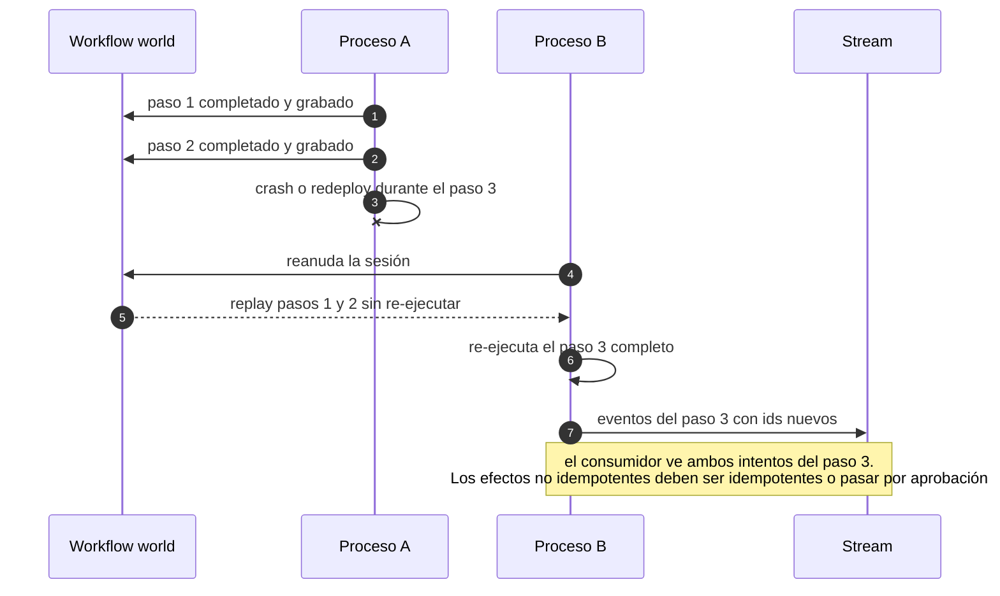
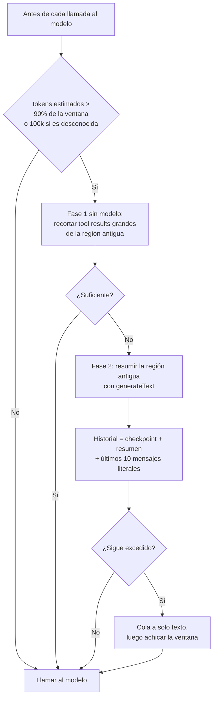
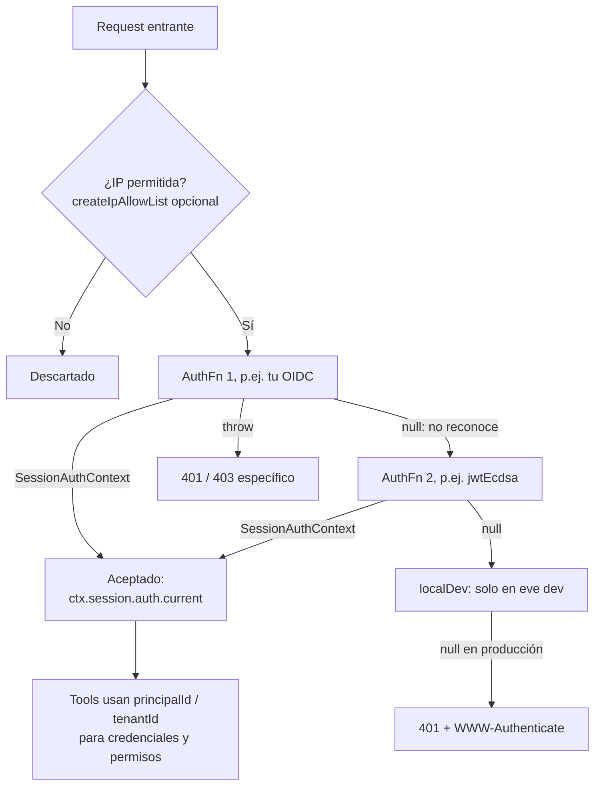
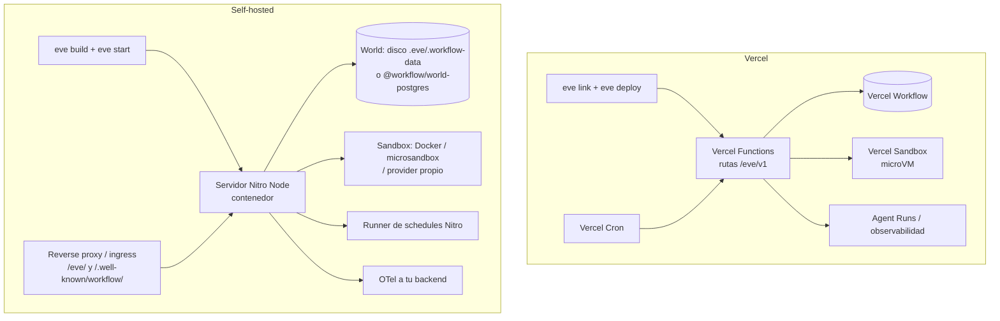

# eve — Arquitectura y flujos internos

[[vercel-eve]] · [[Eve-10-Flujos-Empresariales]] · [[Eve-Implementacion-Self-Hosted]]

Diagramas de **cómo funciona eve por dentro**. Cada diagrama cita la evidencia en `repos/vercel/eve/`. Los detalles de cada dimensión están en el estudio [[vercel-eve]].

---

## 1. Mapa de componentes

Qué piezas hay y cómo se conectan. La línea punteada marca la frontera de confianza: todo lo que está a la izquierda del sandbox tiene acceso a los secretos.

**Evidencia:**
- `repos/vercel/eve/docs/concepts/security-model.md:8-20`: fronteras de confianza.
- `repos/vercel/eve/packages/eve/src/execution/session/entry.ts:48-49`: `workflowEntry`.
- `repos/vercel/eve/packages/eve/src/execution/session/turn-step.ts:125-126`: `turnStep`.
- `repos/vercel/eve/docs/channels/overview.mdx:133-150`: catálogo de canales.

---

## 2. Ciclo de vida de una solicitud HTTP

Camino completo desde `POST /eve/v1/session` hasta la respuesta en el stream.

**Evidencia:**
- `repos/vercel/eve/packages/eve/src/eve-channel/index.ts:150-152`: la auth corre antes de `createSession`.
- `repos/vercel/eve/packages/eve/src/harness/tool-loop.ts:1617`: `ToolLoopAgent`, una llamada por paso.
- `repos/vercel/eve/packages/eve/src/harness/tool-loop.ts:2883-2894`: decide si continuar o terminar.
- `repos/vercel/eve/packages/eve/src/protocol/message.ts:181`: catálogo de eventos.

---

## 3. Sesión → turno → paso

La jerarquía de trabajo y los estados por los que pasa una sesión.

**Evidencia:**
- `repos/vercel/eve/docs/concepts/execution-model-and-durability.mdx:10-16`: niveles sesión / turno / paso.
- `repos/vercel/eve/packages/eve/src/execution/session/turn.ts:82-85`: loop del turno.
- `repos/vercel/eve/packages/eve/src/execution/session/timeout.ts:2`: timeout de 30 días.

---

## 4. Durabilidad: qué pasa si el proceso muere

Solo se re-ejecuta el paso que se interrumpió. Los pasos completados se reproducen desde su resultado grabado.

**Evidencia:**
- `repos/vercel/eve/docs/concepts/execution-model-and-durability.mdx:94-96`: resume after crash.

---

## 5. Decisión de compactación

Qué ocurre antes de cada llamada al modelo.

**Evidencia:**
- `repos/vercel/eve/packages/eve/src/execution/session.ts:12-14`: umbral y ventana.
- `repos/vercel/eve/packages/eve/src/harness/compaction.ts:198-293`: algoritmo.

---

## 6. Resolución de auth de entrada

Cómo se decide quién es el llamante.

**Evidencia:**
- `repos/vercel/eve/packages/eve/src/public/channels/auth.ts:702-735`: `routeAuth`.
- `repos/vercel/eve/docs/guides/auth-and-route-protection.md:37-45`: el walk.
- `repos/vercel/eve/docs/guides/auth-and-route-protection.md:201-203`: allow-list de IPs.

---

## 7. Topologías de despliegue

**Evidencia:**
- `repos/vercel/eve/docs/guides/deployment/overview.md:12-15`: estrategias.
- `repos/vercel/eve/docs/guides/deployment/self-hosting.md:57-62`: prefijos del proxy.
- `repos/vercel/eve/docs/guides/deployment/vercel.mdx:131-136`: servicios de Vercel.

---

[[vercel-eve]] · [[Matriz-Comparativa]]
