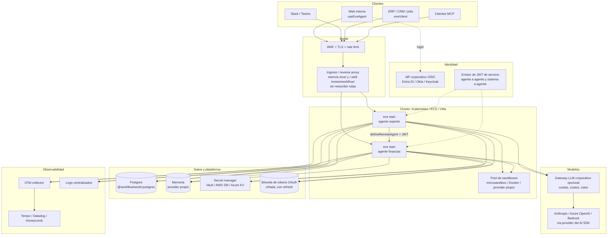
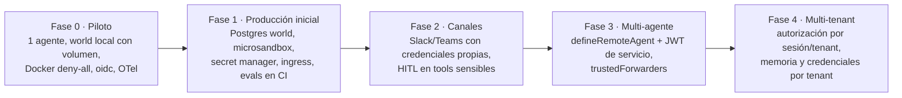

# eve — Implementación empresarial fuera de Vercel

[[vercel-eve]] · [[Eve-Arquitectura-y-Flujos]] · [[Eve-10-Flujos-Empresariales]]

**Respuesta corta:** eve corre fuera de Vercel como un servicio Node normal (`eve build` + `eve start`). Lo que Vercel te da gestionado lo tienes que **traer tú**:
- almacenamiento durable de workflows;
- sandbox aislado;
- identidad (IdP) y autorización por sesión/tenant;
- OAuth y bóveda de tokens;
- secretos;
- ingress;
- observabilidad;
- acceso a modelos con control de costos.

> Convención: **[doc]** = documentado en `repos/vercel/eve/docs`; **[inferencia]** = recomendación de arquitectura nuestra, no documentada por eve.

---

## 1. Arquitectura de referencia (self-hosted)

---

## 2. Qué te da Vercel y qué lo reemplaza fuera

| # | Función | En Vercel | Fuera de Vercel (lo que eve soporta) | Qué te falta aportar |
| --- | --- | --- | --- | --- |
| 1 | Cómputo HTTP | Vercel Functions | `eve start`, servidor Nitro Node en contenedor **[doc]** | Orquestador (K8s/ECS), healthchecks a `/eve/v1/health`, autoscaling |
| 2 | Estado durable | Vercel Workflow | World local en disco (`.eve/.workflow-data`) o `@workflow/world-postgres` **[doc]** | **Postgres gestionado** con backups. El world local sirve para una instancia con volumen persistente **[inferencia]** |
| 3 | Sandbox | Vercel Sandbox (microVM) | Docker, microsandbox, just-bash o `defineSandboxProvider` **[doc]** | Un runtime de aislamiento real. microsandbox soporta políticas por dominio; Docker solo `allow-all`/`deny-all` **[doc]**; just-bash no aísla procesos |
| 4 | Credential brokering en el sandbox | Firewall de Vercel Sandbox | Transforms de headers en microsandbox **[doc]** | Con Docker: un proxy de egress propio **[inferencia]** |
| 5 | Cron | Vercel Cron | Runner de schedules de Nitro dentro de `eve start` **[doc]** | Garantía de ejecución única con varias réplicas, o un scheduler externo **[inferencia]** |
| 6 | Modelo | AI Gateway con OIDC | `AI_GATEWAY_API_KEY`, o un provider del AI SDK directo **[doc]** | Claves por entorno. **Control de costos**: eve toma el costo de la metadata del gateway, así que sin gateway solo tienes tokens **[doc + inferencia]** |
| 7 | Auth de entrada | `vercelOidc()` | `oidc()`, `jwtEcdsa()`, `jwtHmac()`, `httpBasic()` o `AuthFn` propio **[doc]** | Configuración del IdP. **Autorización por sesión/tenant**, que eve no aplica **[doc]** |
| 8 | OAuth a SaaS por usuario | Vercel Connect (consentimiento, almacenamiento cifrado, refresh) | `defineInteractiveAuthorization` **[doc]** | **Bóveda de tokens** cifrada con refresh y revocación |
| 9 | Agente a agente | Transporte por defecto con OIDC de Vercel | `defineRemoteAgent` / `transport` con `url`, `auth` y `headers` **[doc]** | Identidad de servicio: un emisor de JWT o mTLS |
| 10 | Observabilidad | Agent Runs | `otel()` + `otelIntegration()` hacia tu backend **[doc]** | Collector y APM, dashboards, alertas, retención |
| 11 | Protección del deploy | Deployment Protection | IP allow-list (`createIpAllowList`) **[doc]** | WAF, TLS y rate limiting en tu ingress |
| 12 | Handoff de sesiones entre deploys | Documentado para Vercel producción **[doc]** | — | Estrategia de rolling deploy y compatibilidad de versiones **[inferencia]** |
| 13 | Secretos | Env vars del proyecto | Variables de entorno en runtime **[doc]** | Secret manager con rotación |
| 14 | Memoria entre sesiones | Igual | File memory o providers (Supermemory, Upstash, custom) **[doc]** | Con varias réplicas, un provider propio sobre tu base de datos **[inferencia]** |

**Evidencia:**
- `repos/vercel/eve/docs/guides/deployment/self-hosting.md:8-62`: Node, credenciales, world, sandbox y proxy.
- `repos/vercel/eve/docs/agent-config.md:234-245`: `@workflow/world-postgres@5.0.0-beta.x`.
- `repos/vercel/eve/docs/sandbox/docker.mdx:25` y `repos/vercel/eve/docs/sandbox/microsandbox.mdx:27`: políticas de red.
- `repos/vercel/eve/docs/schedules.mdx:150-154`: schedules en hosts propios.
- `repos/vercel/eve/packages/eve/src/harness/tool-loop.ts:2046-2075`: el costo sale de `providerMetadata.gateway`.
- `repos/vercel/eve/docs/connections/overview.mdx:181` y `:236-238`: Vercel Connect frente a OAuth propio.
- `repos/vercel/eve/docs/subagents/index.mdx:126-141`: transporte explícito fuera de Vercel.
- `repos/vercel/eve/docs/guides/instrumentation/otel.mdx:10-70`: OpenTelemetry.
- `repos/vercel/eve/docs/concepts/execution-model-and-durability.mdx:26`: handoff en Vercel.

---

## 3. Los componentes que te faltan, en orden de prioridad

1. **Capa de autorización por sesión y tenant.** Es la brecha más importante: "Route auth does not enforce session ownership". Hay que construirla con un mapeo sesión→dueño en tu app o en un proxy, `tenantId` en la auth, validación en las tools y políticas de approval.
2. **Postgres para el world.** Con durabilidad real y backups; valida su comportamiento con varias réplicas antes de producción. El protocolo es `5.0.0-beta`.
3. **Sandbox aislado.** microsandbox (VMs ligeras, con políticas de dominio) o un provider propio sobre gVisor, Firecracker o pods efímeros. Evita montar el socket de Docker en producción **[inferencia]**.
4. **Integración con el IdP.** `oidc()` para usuarios y JWT de servicio para sistemas y agentes.
5. **Bóveda de tokens OAuth**, si los agentes actúan como el usuario en SaaS (flujo 4).
6. **Secret manager**, que inyecte variables de entorno en runtime (nunca en el build).
7. **Ingress** que reenvíe `/eve/` **y** `/.well-known/workflow/`, más WAF y TLS.
8. **Observabilidad OTel**, con `tracePolicy` que respete el audience (`private` = no capturar contenido).
9. **Gateway LLM o contabilidad de costos**, si no usas AI Gateway.
10. **Scheduler con ejecución única**, si hay varias réplicas.
11. **Gobierno de datos**: retención y borrado de sesiones en el world, residencia de datos del modelo, aviso de IA al usuario (responsible use).
12. **CI/CD con evals** (`eve eval`) como gate antes del deploy.

---

## 4. Plan de implementación sugerido

**Checklist antes de producción** (basado en el pre-production checklist de eve y ampliado):
- [ ] `placeholderAuth()` reemplazado; un request sin auth devuelve 401.
- [ ] Mapeo sesión→usuario/tenant aplicado fuera de eve.
- [ ] Firmas de canal verificadas (`SLACK_SIGNING_SECRET`, etc.).
- [ ] Secretos solo en runtime, nunca en el sandbox ni en los artefactos.
- [ ] Sandbox con `deny-all` o una allow-list.
- [ ] `approval` en toda tool irreversible; efectos idempotentes.
- [ ] World persistente y respaldado; restauración probada.
- [ ] Proxy con ambos prefijos; `curl /eve/v1/health` y `eve dev https://host` completan un turno real.
- [ ] OTel exportando, sin contenido en sesiones `private`.
- [ ] Evals en CI.

**Evidencia:**
- `repos/vercel/eve/docs/concepts/security-model.md:84-101`: pre-production checklist.
- `repos/vercel/eve/docs/guides/deployment/self-hosting.md:108-120`: verificación.
- `repos/vercel/eve/docs/responsible-use.md`: responsabilidades de quien despliega.

---

[[vercel-eve]] · [[Matriz-Comparativa]]
