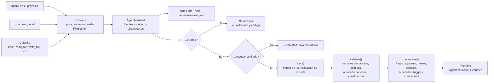

# arnes0.1 filesystem-first — estructura del directorio `agent/`

[[vercel-eve]] · [[Eve-vs-BookHarness-vs-Pi]] · [[BH-Propuestas]] · [[Home]]

> *"eve is a filesystem-first framework for durable AI agents. Core agent capabilities live in conventional locations, so projects are easier to inspect, extend, and operate."* — `repos/vercel/eve/README.md:17-18`

**Pregunta:** ¿cómo llevamos esto a **nuestro harness** (`arnes0.1/`) con una estructura **mejor y más completa** que la de eve, que cubra MCP, A2A, canales, WebSockets, schedules, fuentes de datos y APIs?

**Respuesta corta:** con un directorio **`agent/` obligatorio**, organizado por **responsabilidad** en cinco familias:

| Familia | Qué agrupa |
| --- | --- |
| **Identidad** | quién es el agente |
| **Capacidades** | qué puede hacer localmente |
| **Integraciones de salida** | a quién llama: MCP, OpenAPI, A2A, datos |
| **Entradas y automatización** | quién lo llama: canales HTTP/WS/MCP/A2A, schedules, triggers |
| **Gobierno y operación** | políticas, secretos, memoria, sandbox, observabilidad, evals |

Se toma la estructura de eve, **inventariada en detalle** en §1, y se complementa con lo que eve no tiene. Unas cosas vienen de **pi**: dos ámbitos, plantillas de comandos, skills como paquete, confianza del proyecto. Otras de **book-harness**: políticas, admisión, gobierno de datos, secretos declarados y límites explícitos.

- **Plan:** `plans/006-arnes-filesystem-first-2026-09-24.md`.
- **Cambio frente a v1:** `agent/` ya **no es opcional**; sin él, arnes no arranca y ofrece `arnes init`.

> **Convenciones:** **[eve]**, **[pi]** y **[libro]** marcan el origen de cada idea, con cita. **[propuesta]** es diseño nuestro. `EVE` = `repos/vercel/eve`, `PI` = `repos/earendil-works/pi/packages/coding-agent`, `K` = `repos/aaramirez/book-harness/constitution/ARCHITECTURE_CONSTITUTION.md`.

---

## 1. La estructura de eve, en detalle

### 1.1 Gramática global
- **La ruta es la identidad:** no hay campo `name`.
  - `EVE/docs/reference/agent-files.md:32-43`
- **Formatos de archivo:**
  - Módulos `.ts .mts .cts .js .mjs .cjs`; los `.d.ts` se ignoran.
  - Los slots de markdown se reconocen sin distinguir mayúsculas.
  - `EVE/packages/eve/src/discover/filesystem.ts:7-14`
- **Los defaults ocupan las mismas ranuras:** un archivo en la misma ruta los reemplaza.
  - `EVE/docs/reference/agent-files.md:30`
- **Diagnósticos con código:**
  - `discover/slot-collision` (un `.md` y un módulo con el mismo nombre)
  - `discover/module-slot-collision`
  - `discover/unsupported-directory` (warning por directorio desconocido)
  - `discover/required-instructions-missing`
  - `EVE/packages/eve/src/discover/grammar.ts:154`
- **Directorios generados que se ignoran:** `.eve .next .output .vercel node_modules`.
  - `EVE/packages/eve/src/discover/filesystem.ts:23-30`
- **Hay tres layouts:**
  - **anidado:** `agent/` más un `package.json`;
  - **plano:** los slots en la raíz;
  - **workspace:** `agents/<nombre>/`, y un `agent/` en la raíz gana sobre `agents/`.
  - `EVE/docs/reference/agent-files.md:85-104`, `EVE/docs/concepts/project-structure.mdx:42-52`
- **Artefactos inspeccionables:**
  - `.eve/discovery/agent-discovery-manifest.json`, `diagnostics.json` y `compile/compiled-agent-manifest.json`;
  - `eve info [--json]`.
  - `EVE/docs/reference/cli.md:14`, `:146-156`
- **Las gramáticas de nombres no son uniformes:**
  - tools: `^[a-zA-Z][a-zA-Z0-9_-]{0,63}$`
  - connections: `^[a-z][a-z0-9-]{0,63}$`
  - channels: `^(\.?[a-z][a-z0-9-]{0,63}|\[…\])$`
  - `EVE/packages/eve/src/discover/grammar.ts:119`, `:126`, `:131`

### 1.2 Las ranuras de eve

| Ranura | Formas | Qué define | Raíz / subagente | Evidencia |
| --- | --- | --- | --- | --- |
| `agent.ts` | módulo, opcional | `model`, `reasoning`, `compaction`, `limits`, `outputSchema`, `experimental.workflow` | ambos (en un subagente, `description` es obligatoria) | `EVE/docs/agent-config.md:24-114` |
| `instructions.md`, `.ts` o `instructions/` | `.md` literal (sin frontmatter), módulo o directorio no recursivo | system prompt; también dinámico por sesión o turno | obligatorio en la raíz | `EVE/docs/instructions.mdx:55-59` |
| `tools/` | módulos recursivos; `billing/refund.ts` → `billing-refund` | `defineTool`, `defineWorkflowTool`, `disableTool()` | ambos | `EVE/docs/tools/overview.mdx:26-120` |
| `skills/` | `<n>.md`, módulo o paquete `<n>/SKILL.md` + `scripts/ references/ assets/` | `description`, `license`, `metadata`; se carga con `load_skill` | ambos | `EVE/docs/skills.mdx:30-77` |
| `connections/` | `<n>.ts` o `<n>/connection.ts` | **MCP** (`url` HTTP/SSE, `tools.allow/block`, `auth`, `approval`) u **OpenAPI** (`spec`, `operations`, `baseUrl`); tools `<conn>__<tool>` vía `connection_search` | ambos | `EVE/docs/connections/mcp.mdx:14-107`, `EVE/docs/connections/openapi.mdx:14-116` |
| `channels/` | módulos recursivos | `defineChannel({ routes: [GET/POST/…/WS], events, turnPolicy, cors })`; defaults `eve.ts` (API `/eve/v1`) y `home.ts` | **solo raíz** | `EVE/docs/channels/custom.mdx:21-69`, `:192-231` |
| `schedules/` | `.md` (frontmatter `cron`) o `.ts` (`defineSchedule`) | cron con prompt o handler `run` | **solo raíz** | `EVE/docs/schedules.mdx:12-89` |
| `subagents/` | `<id>/` (agente propio) o `<id>.ts` (`defineRemoteAgent` / `defineWorkspaceAgent`) | delegación sin herencia implícita | ambos | `EVE/docs/subagents/index.mdx:92-238` |
| `hooks/` | módulos recursivos | `defineHook({ events })`: **solo observan**, entrega al menos una vez | ambos | `EVE/docs/guides/hooks.md:10-29` |
| `memory.ts` o `memory/<slot>.ts` | uno de los dos | `defineMemory({ provider, scope, visibility })` | ambos | `EVE/docs/memory/overview.mdx:210-218` |
| `sandbox.ts` o `sandbox/` | `sandbox.ts`, `workspace/**`, `Dockerfile` | entorno aislado; `workspace/**` siembra `/workspace` | ambos | `EVE/docs/sandbox/index.mdx:44-125` |
| `extensions/` | `<ns>.ts` o `<ns>/extension.ts` | montaje de paquetes con prefijo `ns__` | ambos | `EVE/docs/extensions.md:176-316` |
| `instrumentation/` | un proveedor por archivo | destinos de telemetría | **solo raíz** | `EVE/docs/guides/instrumentation/instrumentation.mdx:17-18` |
| `lib/` | módulos recursivos | código auxiliar; se importa, no se copia al sandbox | ambos | `EVE/docs/reference/agent-files.md:59` |
| `evals/` | **al lado** de `agent/`; `*.eval.ts` + `evals.config.ts` + `data/` | evals con juez; dentro de `agent/` es un error | — | `EVE/docs/evals/overview.mdx:43-102` |

### 1.3 Protocolos y datos en eve
- **MCP en los dos sentidos:**
  - como cliente, por `connections/` (**solo HTTP/SSE**, no stdio);
  - como servidor, con el canal `mcpChannel`.
  - `EVE/docs/connections/mcp.mdx:14`, `EVE/docs/channels/mcp.mdx:10-40`
- **WebSockets de entrada:** como ruta `WS()` de un canal propio. No hay WebSockets **de salida**, como fuente de datos.
  - `EVE/docs/channels/custom.mdx:192-231`
- **A2A: no.** Entre agentes se usa el protocolo HTTP propio de eve (`POST /eve/v1/session` + callback). A2A solo aparece en borradores de `research/`.
  - `EVE/docs/channels/eve.mdx:8`, `EVE/docs/guides/remote-agents.md:185-203`
- **Fuentes de datos: no hay una ranura propia.** Un warehouse se conecta como MCP, una API como OpenAPI, y un dataset va en `lib/` o se siembra por `sandbox/workspace/`.
  - `EVE/docs/tutorial/connect-a-warehouse.mdx:40-57`, `EVE/docs/sandbox/index.mdx:114-125`

---

## 2. Qué le falta a eve (y qué aportan pi y el libro)

| Hueco en eve | Quién lo resuelve | Cómo |
| --- | --- | --- |
| **A2A** (Agent2Agent) | — (nadie de los tres) | [propuesta] `connections/a2a/` (cliente, por Agent Card) y `channels/a2a.ts` (servidor) |
| **MCP por stdio** (servidores locales) | — | [propuesta] `transport: 'stdio'` en `connections/mcp/` |
| **Fuentes de datos como ranura propia**, con clasificación | libro: DataGovernanceEngine, P-22 | [propuesta] `data/<fuente>.ts` con `classification`, `access: read-only`, `scope` |
| **WebSocket o stream de salida** (suscribirse a un feed) | — | [propuesta] `data/` de tipo `stream` (ws, sse, cola) que puede disparar `triggers/` |
| **Triggers por evento** (no solo cron) | libro: P-16, todo estímulo es un `ActivationRequest` | [propuesta] `triggers/<n>.ts` (stream, file-watch, cola); `schedules/` queda para cron |
| **Políticas centrales** (no solo `approval` por tool) | libro: PolicyEngine, fail-closed | [propuesta] `policies/tools.ts`, `admission.ts`, `data.ts` |
| **Secretos declarados** (qué necesita el agente) | libro: CredentialBroker, INV-E08 | [propuesta] `secrets.ts` con nombres y fuentes, **nunca** valores; se valida al arrancar |
| **Plantillas de comandos** (`/nombre` con argumentos) | pi: `prompts/`, `$1`, `$ARGUMENTS` | [pi] `commands/<n>.md`: `PI/docs/prompt-templates.md:9-49` |
| **Dos ámbitos**, global del usuario y del proyecto | pi: `~/.pi/agent` + `.pi/`, el proyecto gana | [pi] `~/.arnes/` para skills, comandos, conexiones y `trust.json` personales: `PI/docs/configuration.md:3-45` |
| **Confianza del proyecto** antes de ejecutar código | pi: `trust.json` | [pi] `PI/docs/security.md:37-78` |
| **Hooks que intervienen** (eve solo tiene hooks que observan) | pi: `tool_call` puede bloquear; libro: P-12 | [propuesta] `hooks/` con puntos declarados (`before_tool` puede bloquear), separados de `observers/` |
| **Límites explícitos obligatorios** | libro: INV-09 | [libro] `agent.ts` obligatorio, con `limits`: `K:182-194` |
| **Gramática de nombres uniforme** | — (eve tiene tres) | [propuesta] una sola regex para todas las ranuras |

---

## 3. La estructura propuesta

```text
mi-proyecto/
├── AGENTS.md                         # contexto del repo (como hoy; no es identidad)
├── agent/                            # OBLIGATORIO
│   │  ── Identidad ───────────────────────────────────────────────
│   ├── agent.ts                      # OBLIGATORIO: defineAgent({ description, model, limits, ... })
│   ├── instructions.md               # OBLIGATORIO (o instructions/*.md, en orden)
│   │
│   │  ── Capacidades locales ─────────────────────────────────────
│   ├── tools/<n>.ts                  # defineTool / disabled(); defaults: bash, read_file, write_file
│   ├── skills/<n>.md | <n>/SKILL.md  # Agent Skills: + scripts/ references/ assets/
│   ├── commands/<n>.md               # plantillas → /n ($1, $ARGUMENTS)
│   │
│   │  ── Integraciones de salida (el agente es CLIENTE) ─────────
│   ├── connections/
│   │   ├── mcp/<n>.ts                # defineMcpConnection({ transport: 'stdio'|'http', ... })
│   │   ├── openapi/<n>.ts            # defineOpenApiConnection({ spec, baseUrl, operations })
│   │   └── a2a/<n>.ts                # defineA2aAgent({ agentCardUrl, skills.allow, auth })
│   ├── data/<n>.ts                   # defineDataSource({ kind: 'sql'|'files'|'http'|'stream', ... })
│   ├── data/files/**                 # datasets versionados, solo lectura
│   │
│   │  ── Entradas y automatización (el agente es SERVIDOR) ──────
│   ├── channels/
│   │   ├── cli.ts                    # default: el REPL actual (reemplazable o desactivable)
│   │   ├── http.ts                   # API de sesiones (tipo /eve/v1)
│   │   ├── ws/<n>.ts                 # WebSocket de entrada
│   │   ├── mcp.ts                    # exponer el agente como servidor MCP
│   │   ├── a2a.ts                    # exponer Agent Card + endpoint A2A
│   │   └── webhooks/<n>.ts           # Slack, GitHub, un sistema interno…
│   ├── schedules/<n>.md | <n>.ts     # cron (frontmatter cron, o defineSchedule con run)
│   ├── triggers/<n>.ts               # por evento: stream de data/, archivo, cola
│   ├── subagents/<n>/                # agente local (mismo layout, sin channels/ ni schedules/)
│   │
│   │  ── Gobierno y operación ────────────────────────────────────
│   ├── policies/
│   │   ├── tools.ts                  # allow / deny / require_approval por tool y argumentos (fail-closed)
│   │   ├── admission.ts              # quién puede abrir una sesión por cada canal
│   │   └── data.ts                   # clasificación y retención por fuente
│   ├── secrets.ts                    # nombres y fuentes (env / vault), nunca valores
│   ├── hooks/<n>.ts                  # intervienen en puntos declarados (before_tool puede bloquear)
│   ├── observers/<n>.ts              # solo observan eventos (auditoría, métricas)
│   ├── memory/<slot>.ts              # memoria entre sesiones
│   ├── sandbox/                      # sandbox.ts + workspace/** (entorno aislado)
│   ├── instrumentation/<n>.ts        # destinos de trazas y de auditoría
│   └── lib/**                        # código auxiliar, solo import
├── evals/                            # al lado de agent/, nunca dentro
│   ├── evals.config.ts
│   ├── **/*.eval.ts
│   └── data/
└── .arnes/                           # generado, en .gitignore
    ├── manifest.json                 # lo que se descubrió, con origen y ruta
    └── diagnostics.json
~/.arnes/                             # ámbito global del usuario (pi)
├── skills/  commands/  connections/  # personales; el proyecto gana ante un empate
├── auth.json                         # credenciales del usuario (fuera del repo)
└── trust.json                        # decisiones de confianza por proyecto
```

### 3.1 Cada ranura: qué es y de dónde sale

| Ranura | Obligatoria | Nombre expuesto | Raíz / subagente | Origen | Componente del libro que materializa |
| --- | --- | --- | --- | --- | --- |
| `agent.ts` | **sí** | — | ambos | [eve] + [libro] INV-09 | `AgentConfig` (C-002), `ExecutionBudget` (C-012) |
| `instructions.md` / `instructions/` | **sí** | — | raíz; opcional en subagentes | [eve] | ContextEngine (bloque de sistema) |
| `tools/` | no | `<n>` | ambos | [eve] | CapabilityRegistry + ToolRuntime |
| `skills/` | no | `<n>` (+ `/skill:<n>`) | ambos | [eve] + [pi] | SkillLibrary |
| `commands/` | no | `/<n>` | raíz | [pi] | adaptador de UI (P-11) |
| `connections/mcp/` | no | `<conn>__<tool>` | ambos | [eve] + stdio | CapabilityRegistry + CredentialBroker |
| `connections/openapi/` | no | `<conn>__<operationId>` | ambos | [eve] | CapabilityRegistry + CredentialBroker |
| `connections/a2a/` | no | tool `<agente>` (delegación) | ambos | [propuesta] | AgentCommunicationGateway |
| `data/` | no | `<fuente>__query`, `__read` | ambos | [propuesta] + [libro] P-22 | ContextEngine + DataGovernanceEngine |
| `channels/` | no (default: `cli.ts`) | ruta | **solo raíz** | [eve] + A2A | Ingress Adapter → AdmissionController |
| `schedules/` | no | `<n>` | **solo raíz** | [eve] | fuente de `ActivationRequest` (P-16) |
| `triggers/` | no | `<n>` | **solo raíz** | [propuesta] + [libro] P-16 | fuente de `ActivationRequest` |
| `subagents/` | no | tool `<n>` | ambos (anidados) | [eve] | delegación interna (P-20) |
| `policies/` | **sí: al menos `tools.ts`** si hay tools con side effects | — | ambos | [libro] | PolicyEngine, AdmissionController, DataGovernanceEngine |
| `secrets.ts` | sí, si alguna conexión o dato lo requiere | — | raíz | [libro] | CredentialBroker |
| `hooks/` | no | punto de enganche | ambos | [pi] + [libro] P-12 | ExtensionHost (propuesto) |
| `observers/` | no | — | ambos | [eve] (sus hooks) | EventBus |
| `memory/` | no | `<slot>__<tool>` | ambos | [eve] | SessionManager / ContextEngine |
| `sandbox/` | no | — | ambos | [eve] | IsolatedExecutionEnvironment (propuesto) |
| `instrumentation/` | no | — | **solo raíz** | [eve] | EventBus + AuditLedger |
| `lib/` | no | — | ambos | [eve] | — |
| `evals/` (al lado) | no | `<ruta>` | — | [eve] + [pi] lift | EvaluationHarness |

---

## 4. Reglas de la convención

1. **R1 — `agent/`, `agent.ts` e `instructions.md` son obligatorios.**
   - Sin ellos, arnes **no arranca**: diagnóstico `discover/required-agent-dir-missing` (o `-config-` / `-instructions-`) con la ruta esperada, y la sugerencia `arnes init`.
   - `agent.ts` exige `description`, `model` y **`limits`** (`maxTurns`, `maxToolCalls`, `maxCostUsd`), por INV-09.
2. **R2 — Una sola gramática de nombres:** `^[a-z][a-z0-9-]{0,63}$` para todas las ranuras.
   - Una subcarpeta de `tools/`, `channels/`, `schedules/` o `triggers/` agrega un prefijo con `-`: `tools/billing/refund.ts` → `billing-refund`.
   - Hacia el modelo, `-` se expone tal cual y las conexiones usan `__`.
   - Un duplicado, sin distinguir mayúsculas, es un error.
3. **R3 — Los defaults ocupan las mismas ranuras:**
   - `tools/bash.ts`, `read_file.ts` y `write_file.ts`, y `channels/cli.ts`.
   - Un archivo propio los reemplaza, `disabled()` los quita, y `defaultTools: false` quita todas las tools por defecto.
4. **R4 — El markdown es dato:** frontmatter con un subconjunto de YAML y parser propio, porque arnes no tiene dependencias. `---js` y la sintaxis desconocida son un error.
5. **R5 — El código es código: confianza antes de importar.**
   - Los `.ts` de `agent/` se importan solo si el proyecto es confiable (`~/.arnes/trust.json`).
   - Sin confianza, **no arranca en modo agente completo**: puede abrir en "solo markdown" (instructions, skills, commands) si el usuario lo pide con `--untrusted`.
6. **R6 — Todo es inspeccionable:**
   - `arnes info [--json]` y `/info` imprimen el manifiesto, con **origen** (proyecto, global o default), ruta y diagnósticos.
   - Se escribe `.arnes/manifest.json`.
   - Un error detiene el arranque.
7. **R7 — Las entradas no se abren solas:**
   - Todo canal distinto de `cli.ts` exige su regla en `policies/admission.ts`. Sin regla, el canal se descubre pero **no escucha**, y aparece un diagnóstico.
   - Es el `placeholderAuth()` de eve (`EVE/docs/concepts/security-model.md:80-90`), llevado a la estructura.
8. **R8 — Los datos se declaran con su clasificación:**
   - Toda fuente en `data/` declara `classification` (`public`, `internal`, `confidential` o `restricted`) y `access` (`read-only` por defecto).
   - Sin clasificación, se trata como `restricted`: fail-closed, como el DataGovernanceEngine del libro (`repos/aaramirez/book-harness/book/chapters/20-data-governance-engine/chapter.md:1028-1057`).
9. **R9 — Los secretos se declaran, nunca se escriben:**
   - `secrets.ts` lista nombres y fuentes.
   - Si un archivo de `agent/` contiene algo con forma de secreto (`sk-`, `AKIA`, `-----BEGIN`), es un error.
   - Una conexión que referencia un secreto no declarado es un error.
10. **R10 — Dos ámbitos, y el proyecto gana:**
    - `~/.arnes/` aporta **solo** skills, commands y connections personales, y nunca policies ni channels.
    - Ante un nombre repetido gana el proyecto, y el manifiesto muestra el origen.
11. **R11 — Las evals viven fuera de `agent/`.** Un `*.eval.ts` dentro de `agent/` es un error, como en eve.

---

## 5. Ejemplos mínimos

```ts
// agent/agent.ts  (obligatorio)
import { defineAgent } from 'arnes/define';
export default defineAgent({
  description: 'Asistente de soporte de facturación',
  model: 'claude-sonnet-4-5',
  limits: { maxTurns: 30, maxToolCalls: 60, maxCostUsd: 2 },
  compaction: 'sliding-window',
});
```

```ts
// agent/connections/mcp/github.ts
import { defineMcpConnection } from 'arnes/define';
export default defineMcpConnection({
  transport: 'stdio',
  command: ['npx', '-y', '@modelcontextprotocol/server-github'],
  env: { GITHUB_TOKEN: { secret: 'GITHUB_TOKEN' } },
  tools: { allow: ['search_issues', 'get_issue'] },
});
```

```ts
// agent/connections/a2a/facturacion.ts
import { defineA2aAgent } from 'arnes/define';
export default defineA2aAgent({
  agentCardUrl: 'https://billing.internal/.well-known/agent.json',
  auth: { bearer: { secret: 'BILLING_A2A_TOKEN' } },
  skills: { allow: ['refund-status'] },
});
```

```ts
// agent/data/pedidos.ts
import { defineDataSource } from 'arnes/define';
export default defineDataSource({
  kind: 'sql',
  url: { secret: 'ORDERS_DB_URL' },
  classification: 'confidential',
  access: 'read-only',
  expose: { tables: ['orders', 'order_items'] },
});
```

```ts
// agent/data/precios.ts  (WebSocket de salida → puede disparar un trigger)
import { defineDataSource } from 'arnes/define';
export default defineDataSource({
  kind: 'stream',
  transport: 'websocket',
  url: 'wss://feed.internal/prices',
  classification: 'internal',
});
```

```ts
// agent/triggers/alerta-precio.ts
import { defineTrigger } from 'arnes/define';
export default defineTrigger({
  source: { data: 'precios' },
  when: (event) => event.changePct > 5,
  prompt: (event) => `El precio de ${event.sku} cambió ${event.changePct}%. Evalúa el impacto.`,
});
```

```ts
// agent/policies/tools.ts
import { defineToolPolicy } from 'arnes/define';
export default defineToolPolicy({
  default: 'deny',
  rules: [
    { tool: 'read_file', decision: 'allow' },
    { tool: 'bash', decision: 'require_approval' },
    { tool: 'pedidos__query', decision: 'allow' },
    { tool: 'facturacion', decision: 'require_approval' },
  ],
});
```

```md
<!-- agent/schedules/resumen-diario.md -->
---
cron: "0 12 * * 1-5"
---
Prepara el resumen diario de pedidos atrasados y deja el reporte en /workspace/reportes.
```

---

## 6. Arquitectura del descubrimiento



**Tipos [propuesta]** (resumen):

```ts
type Origin = 'project' | 'global' | 'default';
interface Source { slot: SlotKind; name: string; path: string; origin: Origin; disabled?: boolean }
interface AgentManifest {
  root: string;                       // agent/ (obligatorio)
  config: Source;                     // agent.ts
  instructions: Source[];
  sources: Source[];                  // tools, skills, commands, connections, data, channels, ...
  diagnostics: Diagnostic[];          // { level, code: 'discover/...', path, message }
}
```

---

## 7. Fases (qué entra primero)

arnes0.1 es hoy un REPL local, así que no conviene declarar ranuras sin un runtime detrás. El manifiesto **reconoce** todas las ranuras desde la fase 1, pero las de fases posteriores se reportan como `discover/slot-not-yet-supported` (warning), para que la estructura quede fija desde el principio.

| Fase | Ranuras con runtime | Requiere en arnes0.1 |
| --- | --- | --- |
| **1. Núcleo** | `agent.ts`, `instructions`, `tools/`, `skills/`, `commands/`, `policies/tools.ts`, `secrets.ts`, `lib/`, `.arnes/`, `~/.arnes/`, `arnes init` / `arnes info` | discover, load y assemble; policy engine mínimo (lo que hoy es la puerta de confirmación) |
| **2. Integraciones de salida** | `connections/mcp/` (stdio + http), `connections/openapi/`, `data/` (`files`, `sql` read-only, `http`) | cliente MCP propio sin dependencias (JSON-RPC sobre stdio/HTTP); parser OpenAPI mínimo |
| **3. Entradas y automatización** | `channels/http.ts`, `channels/ws/`, `channels/webhooks/`, `policies/admission.ts`, `schedules/`, `triggers/`, `data/` stream | servidor HTTP/WS de Node, scheduler, sesiones persistentes |
| **4. Multi-agente y protocolos** | `subagents/`, `connections/a2a/`, `channels/a2a.ts`, `channels/mcp.ts` | Agent Card, JSON-RPC A2A, servidor MCP |
| **5. Operación** | `memory/`, `sandbox/`, `hooks/`, `observers/`, `instrumentation/`, `evals/` | aislamiento, eventos tipados, runner de evals |

---

## 8. Qué **no** se copia de eve

| De eve | Decisión | Razón |
| --- | --- | --- |
| Layout plano (slots en la raíz del proyecto) | ✖ | Con `agent/` obligatorio hay una sola forma, y un proyecto nunca mezcla archivos del agente con los de la app. |
| Workspace `agents/<n>/` | ✖ por ahora | Primero `subagents/` (fase 4). |
| Extensiones montadas con prefijo `ns__` | ✖ por ahora | Se cubren con el ámbito global y, más adelante, con paquetes al estilo pi. |
| Compilador y build | ✖ | Node ≥ 23.6 importa `.ts` directo. `.arnes/manifest.json` da la misma inspección. |
| Hooks que solo observan, bajo el nombre `hooks/` | cambiado | Aquí `hooks/` **interviene** en puntos declarados y `observers/` **observa**. Es la distinción P-12 del libro ("events observe; hooks intervene", `K:135-137`). |

---

## 9. Riesgos

- **Superficie grande:** 20 ranuras. Mitigación: un manifiesto único desde la fase 1 y runtime por fases. Una ranura sin soporte avisa, nunca se ignora en silencio.
- **Ejecutar código de un repo ajeno:** R5 (confianza) + R9 (secretos) + R7 (entradas cerradas).
- **Protocolos sin dependencias** (MCP, A2A): implementarlos a mano es trabajo real. Se acotan a los subconjuntos necesarios, con tests contra servidores de ejemplo.
- **Windows:** rutas normalizadas a POSIX, y unicidad sin distinguir mayúsculas (R2).

---

[[vercel-eve]] · [[Eve-vs-BookHarness-vs-Pi]] · [[BH-Propuestas]]
