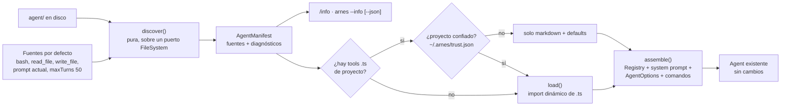

# arnes0.1 filesystem-first — el sistema de archivos como interfaz de autoría

[[vercel-eve]] · [[Eve-vs-BookHarness-vs-Pi]] · [[BH-Propuestas]] · [[Home]]

> *"eve is a filesystem-first framework for durable AI agents. Core agent capabilities live in conventional locations, so projects are easier to inspect, extend, and operate."* — `repos/vercel/eve/README.md:17-18`

**Pregunta:** ¿cómo llevamos esta idea a **nuestro harness**, `arnes0.1/`?

**Respuesta corta:** con una **capa de descubrimiento** entre el disco y el runtime que ya existe. Un directorio `agent/` con ranuras convencionales se lee al arrancar, se **valida**, se convierte en un **manifiesto inspeccionable** y recién entonces se arma el `Agent`.

El loop, los providers y el registry **no cambian**; lo que cambia es **quién los configura**. Hoy los configura el código de `main.ts`. Después, los archivos del proyecto.

Plan de ejecución: `plans/006-arnes-filesystem-first-2026-09-24.md`.

> Convención: **[eve]** = lo que hace eve (con cita), **[arnes]** = el estado actual de arnes0.1 (con cita), **[propuesta]** = diseño nuestro.

---

## 1. Qué significa "filesystem-first" en eve

1. **La ruta es la identidad.** `agent/tools/get_weather.ts` es la tool `get_weather`, y `agent/skills/summarize.md` es la skill `summarize`. No existe un paso de registro.
   - `repos/vercel/eve/docs/reference/agent-files.md:32-43`
2. **Hay ranuras convencionales**, y solo se agregan las que hacen falta. `instructions.md` es obligatoria; `agent.ts` (modelo, compactación, límites) es opcional.
   - `repos/vercel/eve/docs/reference/agent-files.md:8-30`
3. **Los defaults ocupan las mismas ranuras.** Un archivo en la misma ruta **reemplaza** el default, y `export default disableTool()` lo **elimina**.
   - `repos/vercel/eve/docs/reference/agent-files.md:30`
   - `repos/vercel/eve/packages/eve/src/tools/definition.ts:395-400`
4. **El descubrimiento se valida** directorio por directorio y nombre por nombre, con diagnósticos.
   - `repos/vercel/eve/packages/eve/src/discover/discover-agent.ts:215-224`
5. **Todo es inspeccionable:** `eve info` imprime lo que se resolvió (instrucciones, capabilities, rutas, diagnósticos), y el compilador deja artefactos en `.eve/`.
   - `repos/vercel/eve/docs/reference/cli.md:14`, `:146-149`
   - `repos/vercel/eve/docs/reference/agent-files.md:100`
6. **El markdown es dato:** el frontmatter nunca se evalúa como código.
   - `repos/vercel/eve/docs/concepts/security-model.md:76-78`

**Por qué importa:** separa **qué es el agente** (archivos que se leen, diffean y revisan en un PR) de **cómo corre** (runtime). Es la versión práctica de un principio que book-harness enuncia: *"P-06 — Agents are configuration over a shared runtime"* (`repos/aaramirez/book-harness/constitution/ARCHITECTURE_CONSTITUTION.md:111`).

---

## 2. Cómo está hoy arnes0.1

| Pieza | Hoy | Evidencia |
| --- | --- | --- |
| System prompt | String fijo en el código | `arnes0.1/src/main.ts:25` |
| Contexto de proyecto | Lee `AGENTS.md` si existe (el único archivo que se descubre) | `arnes0.1/src/main.ts:35-43` |
| Tools | Se autorregistran en `Default` como efecto del import; `main.ts` las importa a mano | `arnes0.1/src/tool/bash.ts:72`, `arnes0.1/src/main.ts:19-23` |
| Límites y compactación | `maxTurns: 50` y `NoCompaction` fijos en el código | `arnes0.1/src/main.ts:52-53` |
| Slash commands | Registrados en código | `arnes0.1/src/commands.ts:25-40` |

**Agregar una tool** hoy exige tres cosas: crear el archivo, llamar a `Default.register` e importarlo en `main.ts`. El propio comentario del registry lo dice: *"adding a tool means dropping a file in **and importing it from the wiring**"* (`arnes0.1/src/tool/registry.ts:1-3`).

A favor: el `Registry` ya es la costura correcta. Los tests arman el suyo sin usar `Default` (`arnes0.1/test/agent.test.ts:35`), y `definitions()` ya ordena por nombre (`arnes0.1/src/tool/registry.ts:34-40`).

---

## 3. El directorio `agent/` propuesto para arnes0.1

```text
mi-proyecto/
├── AGENTS.md                 # contexto del repo (se mantiene como hoy)
└── agent/
    ├── agent.ts              # opcional: modelo, maxTurns, compactación, tools por defecto
    ├── instructions.md       # system prompt (o instructions/*.md, concatenados en orden)
    ├── tools/
    │   ├── grep.ts           # → tool "grep"
    │   └── bash.ts           # → reemplaza la tool por defecto "bash"
    ├── skills/
    │   └── review.md         # → skill "review", se carga bajo demanda con load_skill
    └── commands/
        └── explain.md        # → slash command /explain (plantilla de prompt)
```

| Ranura | Qué define | Nombre derivado | ¿Reemplaza un default? | Fase |
| --- | --- | --- | --- | --- |
| `agent.ts` | `defineAgent({ model, maxTurns, compaction, defaultTools })` | — | Sí: los valores de `main.ts` pasan a ser defaults | 1 |
| `instructions.md` / `instructions/` | System prompt base | — | Sí: sin archivo, se usa el prompt actual | 1 |
| `tools/<nombre>.ts` | `export default defineTool({...})` o `disabled()` | `<nombre>` | Sí: `bash`, `read_file` y `write_file` son defaults en esas rutas | 1 |
| `skills/<nombre>.md` | Frontmatter `description` + cuerpo | `<nombre>` | — | 2 |
| `commands/<nombre>.md` | Plantilla de prompt con `$ARGUMENTS` | `/<nombre>` | Sí para los comandos built-in (salvo `/help`, `/exit`) | 2 |
| `hooks/<evento>.ts` | `before_tool` / `after_tool` | `<evento>` | — | 3 (futuro) |
| `subagents/<nombre>/` | Otro `agent/` anidado | `<nombre>` | — | 3 (futuro; el README dice que hoy no hay subagentes) |

**Ejemplos mínimos [propuesta]:**

```ts
// agent/agent.ts
import { defineAgent } from 'arnes/define';
export default defineAgent({ model: 'claude-sonnet-4-5', maxTurns: 30, compaction: 'sliding-window' });
```

```ts
// agent/tools/grep.ts
import { defineTool } from 'arnes/define';
export default defineTool({
  description: 'Search files for a regular expression.',
  inputSchema: { pattern: { type: 'string', description: 'Regex to search for.' } },
  required: ['pattern'],
  async execute({ pattern }) { /* ... */ return { result: '...', isError: false }; },
});
```

```md
<!-- agent/skills/review.md -->
---
description: Checklist to review a diff before approving a write_file.
---
1. Read the whole diff ...
```

---

## 4. Reglas de la convención

1. **R1 — La ruta es la identidad.**
   - El nombre sale del nombre del archivo y debe cumplir `^[a-z][a-z0-9_]*$`.
   - Un nombre inválido o duplicado es un **diagnóstico de error** con la ruta. Nunca se renombra en silencio.
2. **R2 — Los defaults ocupan las mismas ranuras.**
   - `bash`, `read_file`, `write_file`, el prompt actual y los valores de `main.ts` son "fuentes por defecto" en rutas virtuales.
   - Un archivo en la misma ruta los reemplaza; `export default disabled()` los quita.
   - `defaultTools: false` en `agent.ts` quita todos los defaults.
3. **R3 — Compatibilidad hacia atrás.** Sin `agent/`, arnes se comporta **exactamente como hoy**, y `npm test` sigue en verde sin cambios de comportamiento.
4. **R4 — El markdown es dato.**
   - El frontmatter usa un subconjunto de YAML (`clave: valor` y listas simples) con un parser propio, porque el harness no tiene dependencias de runtime.
   - Un bloque `---js` o cualquier otra sintaxis desconocida es un error.
5. **R5 — El código de `agent/` es código: confianza del proyecto antes de importarlo.**
   - Importar `agent/tools/*.ts` **ejecuta** código del repositorio que se abrió. Esta regla viene de **pi**, no de eve.
   - La primera vez se pide una decisión de confianza por ruta canónica, y se guarda en `~/.arnes/trust.json`.
   - En modo no interactivo, sin decisión guardada, se **falla cerrado**: se cargan solo los archivos markdown y los defaults.
   - Evidencia: `repos/earendil-works/pi/packages/coding-agent/docs/security.md:37-51`, `:65-71`.
6. **R6 — Todo descubrimiento es inspeccionable.**
   - El resultado es un `AgentManifest` con fuentes y diagnósticos.
   - `/info` (en el REPL) y `arnes --info` lo imprimen, y `--info --json` lo emite legible por máquina.
   - Un diagnóstico de error detiene el arranque, mostrando la ruta.
7. **R7 — El orden es determinista.** Todo se ordena por nombre, que es lo que ya hace `definitions()`, para no romper el prompt caching.
8. **R8 — `AGENTS.md` no es `instructions.md`.**
   - `instructions.md` dice **quién es el agente**.
   - `AGENTS.md` dice **cómo es este repo**, y se sigue anexando como contexto.
   - Los dos conviven: primero van las instrucciones, luego el contexto del proyecto.

---

## 5. Arquitectura de la capa de descubrimiento



**Tipos [propuesta]:**

```ts
type SourceKind = 'authored' | 'default';

interface ToolSource { name: string; path: string; kind: SourceKind; disabled?: boolean }
interface SkillSource { name: string; path: string; description: string }
interface CommandSource { name: string; path: string; kind: SourceKind }

interface Diagnostic { level: 'error' | 'warning'; code: string; path: string; message: string }

interface AgentManifest {
  root: string | null;              // null = no hay agent/, comportamiento actual
  config: AgentConfigSource;        // agent.ts o defaults
  instructions: string[];           // rutas en orden
  tools: ToolSource[];              // ya ordenadas por nombre
  skills: SkillSource[];
  commands: CommandSource[];
  diagnostics: Diagnostic[];
}
```

**Por qué `discover()` es pura:** recibe un puerto `FileSystem` (`readdir`, `readFile`, `stat`), así los tests usan un disco en memoria. Es el mismo patrón que `MockProvider` en los tests de arnes0.1. `load()` es la única función que importa código.

---

## 6. Qué **no** traer de eve (por ahora) y por qué

| De eve | Decisión | Razón |
| --- | --- | --- |
| Compilador con artefactos en `.eve/` y un paso `build` | ✖ por ahora | Node ≥ 23.6 ejecuta `.ts` sin build (`arnes0.1/package.json:9`, `:16`). El descubrimiento corre al arrancar. Un `--info --json` da la misma inspeccionabilidad. |
| `channels/`, `schedules/`, `sandbox/`, `connections/`, `memory/` | ✖ | arnes0.1 es un REPL local de un usuario. Serían ranuras vacías sin runtime detrás. |
| Workspace con varios `agents/<nombre>/` | ✖ | Sin subagentes todavía. Queda para la fase 3, junto con `subagents/`. |
| `defineAgent` / `defineTool` como API | ✔ | Es lo que hace el archivo autodescriptivo y tipado, y encaja con TypeScript sin build. |
| `disableTool()` y los defaults en las mismas ranuras | ✔ | Permite reemplazar o quitar la tool `bash` sin tocar el core. |
| `eve info` | ✔ como `/info` y `--info` | Es la pieza que hace verdadero el *"easier to inspect"*. |

---

## 7. Relación con book-harness

En [[BH-Propuesta-Lecciones-eve]] el "filesystem como interfaz de autoría" quedó en **"qué no se propone traer"**, por considerarlo una decisión de producto. Visto desde P-06, conviene **matizarlo**:
- **En el runtime del libro:** sigue sin ser un componente. Ningún plano "descubre archivos".
- **Como adaptador de autoría:** sí encaja, como fuente de `AgentConfig` (C-002) y de `CapabilityDescriptor` (C-018), igual que el Ingress Adapter es fuente de `ActivationRequest`. Iría como una sección del capítulo de **ExtensionHost** (CH-38 en el plan 005): *"de dónde vienen las extensiones: paquetes, rutas convencionales y la confianza del proyecto"*.

---

## 8. Riesgos

- **Ejecutar código de un repo no confiado:** R5 lo mitiga. Es el riesgo principal y la razón para tomar la regla de pi.
- **Magia implícita:** "¿de dónde salió esta tool?". R6 lo mitiga: toda fuente aparece en `/info` con su ruta y su tipo (propia o default).
- **Nombres en Windows** (mayúsculas y minúsculas, separadores): se normalizan a POSIX en el manifiesto y se valida la unicidad sin distinguir mayúsculas.
- **Frontmatter:** un parser propio es una superficie de bugs. Por eso se limita a un subconjunto mínimo, con tests de rechazo.

---

[[vercel-eve]] · [[Eve-vs-BookHarness-vs-Pi]] · [[BH-Propuestas]]
