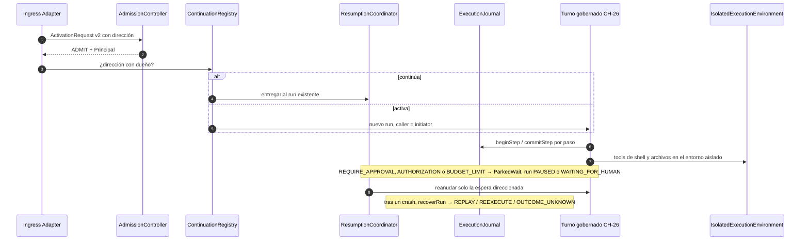

# Propuesta — Incorporar las lecciones de eve a book-harness

[[BH-Propuestas]] · [[BH-Propuesta-Aportes-pi]] · [[Eve-vs-BookHarness-vs-Pi]] · [[vercel-eve]] · [[BH-Implementacion]]

**Objetivo:** convertir las 10 lecciones de eve que le faltan a book-harness ([[Eve-vs-BookHarness-vs-Pi]] §4) en **cambios concretos al libro**: en qué plano, en qué componente (nuevo o existente), con qué contratos, en qué capítulo y bajo qué principio o invariante.

Todo respeta las reglas del propio libro:
- **P-09:** agente único antes que multi-agente.
- **"No magic entities"**, y ningún capítulo usa entidades de un capítulo posterior.
- **EVO-01:** mantener el núcleo pequeño.
- **EVO-07:** justificar las dependencias.
- **EVO-08:** un cambio que rompe un contrato requiere ADR.

> **Estado:** borrador de diseño **[inferencia]**. No modifica `repos/aaramirez/book-harness/`, que es solo lectura en este vault. Para aplicarlo, ver el proceso en [[BH-Propuestas]] §5.
>
> **IDs:** CMP-024.., C-045.., CH-33.. son **propuestos**; la asignación conjunta con la propuesta de pi está en [[BH-Propuestas]] §3.
>
> Abreviatura: `chNN` = `repos/aaramirez/book-harness/book/chapters/NN-*/chapter.md`, `K` = `repos/aaramirez/book-harness/constitution/ARCHITECTURE_CONSTITUTION.md`, `REG` = `repos/aaramirez/book-harness/registry`.

---

## 0. Resumen: dónde va cada lección

| # | Lección de eve | Plano | Componente | Capítulo propuesto | Principio / invariante nuevo |
| --- | --- | --- | --- | --- | --- |
| E1 | La identidad viaja con el turno (L3) + arranque seguro (L4) | Ingress & Activation | AdmissionController (se amplía) | CH-33 | P-31, INV-E15 |
| E2 | El paso es la unidad de durabilidad (L1) | Reliability | **CMP-024 ExecutionJournal** (nuevo) | CH-34 | P-32, INV-E16, INV-E17 |
| E3 | Esperar no cuesta cómputo; cualquier canal reanuda (L2) + OAuth por usuario | Execution | **CMP-025 ResumptionCoordinator** (nuevo) | CH-35 | P-33, INV-E18 |
| E4 | Direcciones de continuación (L6) + schedules como fuente | Ingress & Activation | **CMP-026 ContinuationRegistry** (nuevo) | CH-36 | P-34, INV-E19 |
| E5 | Frontera física secretos / sandbox (L5) | Execution Fabric | **CMP-027 IsolatedExecutionEnvironment** (nuevo) + CredentialBroker | CH-37 | P-35, INV-E20 |
| E6 | Presupuestos que se heredan y reparten (L9) | Execution | ExecutionController (se amplía) | CH-38 | INV-E21 (mecaniza INV-E06) |
| E7 | Un agente también es un servicio: invocación durable (L8) | Agent Interoperability | AgentCommunicationGateway (se amplía) | CH-39 | — (usa P-18..P-21) |
| E8 | El runtime evoluciona con sesiones abiertas (L7) | Execution Fabric + Reliability | SessionManager + ExecutionFabricAdapter (se amplían) | CH-40 | P-36, INV-E22 |
| E9 | Observabilidad acotada por audiencia (L10) | Observability & Governance | DataGovernanceEngine (se amplía) | CH-41 | P-37, INV-E23 |
| — | Integración: el turno durable gobernado | todos | función de integración | CH-43 | — |

El **steering** (L-parcial) y la **compactación en dos fases** vienen reforzados por pi y están en [[BH-Propuesta-Aportes-pi]] (CH-28, CH-29).

```mermaid
flowchart LR
  subgraph T4["Tramo 4: enriquecer el núcleo (pi)"]
    C28["CH-28..32"]
  end
  subgraph T5["Tramo 5: operación durable (eve)"]
    C33["CH-33 Identidad"] --> C34["CH-34 Pasos durables"] --> C35["CH-35 Esperas durables"] --> C36["CH-36 Continuación"] --> C37["CH-37 Entorno aislado"] --> C38["CH-38 Presupuesto jerárquico"]
    C38 --> C39["CH-39 Invocación durable<br/>multi-agente, al final por P-09"] --> C40["CH-40 Evolución del runtime"] --> C41["CH-41 Audiencia"]
  end
  C27["CH-27 existente"] --> T4 --> C33
  C41 --> C42["CH-42 Evaluación con lift (pi)"] --> C43["CH-43 Integración:<br/>turno durable gobernado"]
```



---

## E1. La identidad viaja con el turno (y el arranque es seguro)

- **Lección de eve:** la route auth produce un `SessionAuthContext`. La sesión fija al `initiator`, cada turno renueva `current`, y tools, políticas, credenciales y memoria lo leen. El tenant sale **solo** de la auth verificada. Un scaffold nuevo no acepta tráfico de producción (`placeholderAuth()`), y `localDev()` depende del proceso, no del request.
  - `repos/vercel/eve/docs/guides/auth-and-route-protection.md:288-299`
  - `repos/vercel/eve/docs/guides/auth-and-route-protection.md:205-222`
  - `repos/vercel/eve/docs/patterns/multi-tenant-auth.md:14-37`
- **Hueco en el libro:**
  - P-17 asigna a AdmissionController la verificación de "identity, authorization, tenant", pero ningún contrato lleva el principal verificado más allá de la admisión.
  - `ExecutionContext` (C-004) solo tiene `runId`, `sessionId`, `traceId` y `budget`.
  - `ActivationRequest` (C-022) trae un `externalIdentityRef: Text` sin verificar.
  - `resolveCredentialReference` recibe `agentId`, no un usuario.
  - Citas: `REG/components.yaml:434-443`, `REG/contracts.yaml:68-80`, `REG/contracts.yaml:446-461`, `ch16:878-982`.
- **Dónde:**
  - Plano **Ingress & Activation**.
  - **AdmissionController** gana la decisión "verificar la identidad y producir el principal". Ya está en su `owns` literal (P-17), solo que sin contrato.
  - Capítulo **CH-33 "La Identidad del Llamante y el Arranque que no Admite Nada"**.
- **Contratos:**
  - Nuevos: **C-045 `Principal`** y **C-046 `CallerSnapshot`**.
  - Modificados:
    - **C-004 `ExecutionContext` v2**, que suma `caller: Optional<CallerSnapshot>`. Se agrega como Optional para que ningún componente ya escrito se rompa. Igual requiere **ADR-001**, porque cambia la semántica de 11 `used_by`.
    - **C-023 `AdmissionDecision` v2**, que suma `principal: Optional<Principal>`.
- **Constitución:**
  - **P-31 — Identity travels with every turn** (la identidad verificada acompaña cada turno).
  - **INV-E15 — An unconfigured harness admits nothing, in any environment; development admission depends on process mode, never on the request.**
  - Refuerza P-13, P-17, INV-E07 e INV-19.
- **Boceto:**

```pseudocode
ENUM PrincipalType
    USER
    SERVICE
    RUNTIME
END

STRUCT Principal
    principalId: Text
    principalType: PrincipalType
    issuer: Text
    tenantId: Optional<Text>
    attributes: Map<Text, Value>
END

STRUCT CallerSnapshot
    initiator: Principal
    current: Principal
END

FUNCTION evaluateAdmissionForActivationRequest(request: ActivationRequest) -> AdmissionDecision
    outcome: AdmissionOutcome = REJECT
    principal: Optional<Principal> = verifyExternalIdentity(request.externalIdentityRef)
    IF principal != NULL AND admissionRulesGrantAccess(request, principal)
        outcome = ADMIT
    END
    RETURN AdmissionDecision(requestId = request.id, outcome = outcome, principal = principal, decidedAt = now())
END
```

- **Integración:**
  - La función de integración copia `decision.principal` en `ExecutionContext.caller`: como `initiator` al crear el run, y como `current` en cada entrega posterior.
  - CredentialBroker y PolicyEngine **leen** `caller.current`. Nunca lo reciben como argumento de una tool; el tenant nunca viene del prompt.
- **Decisiones y riesgos:**
  - `verifyExternalIdentity` queda como **punto de extensión declarado**: OIDC, JWT o API key son adaptadores, igual que el Ingress Adapter.
  - Se hereda de eve la advertencia honesta: **"la admisión no es propiedad de sesión"**. El capítulo debe decir explícitamente quién valida que `caller.current` puede operar esa sesión. Se propone una regla de admisión por sesión, no un ACL implícito.

---

## E2. El paso es la unidad de durabilidad y de recuperación

- **Lección de eve:** una llamada al modelo más sus tools inline forman un **paso**, que es un checkpoint.
  - Tras un crash, los pasos completados **se reproducen desde su registro** y no se re-ejecutan.
  - El paso interrumpido se re-ejecuta completo. Por eso los side effects deben ser idempotentes o ir con aprobación.
  - `repos/vercel/eve/docs/concepts/execution-model-and-durability.mdx:94-102`
  - `repos/vercel/eve/packages/eve/src/execution/session/turn-step.ts:125-126`
- **Hueco en el libro:**
  - P-23 exige ejecución durable ("process memory is not the source of truth") e INV-13 exige poder reconstruir un run desde el estado persistido.
  - `createOrUpdateSessionCheckpoint` guarda un `AgentState` al final de fases, pero **no hay un registro por paso** ni una regla de qué se re-ejecuta.
  - Las funciones de integración corren de principio a fin en un proceso.
  - Citas: `K:951-953`, `K:196-202`, `ch10:783-879`, `ch12:829-1040`.
- **Dónde:**
  - Plano **Reliability**.
  - **Componente nuevo CMP-024 `ExecutionJournal`.** Justificación EVO-07: ni SessionManager (historia de la sesión) ni IdempotencyGuard (dedup por clave de capability) poseen la decisión "¿este paso ya se comprometió?".
  - Capítulo **CH-34 "Pasos Durables y la Recuperación a Mitad de Turno"**. Va después de CH-31 (política de replay de pi), que aporta `ReplayPolicy`.
- **Ficha propuesta (formato de `REG/components.yaml`):**
  - `responsibility`: registrar el compromiso de cada paso de un turno (llamada al modelo + tool calls inline) y decidir, al recuperar un run, qué pasos se reproducen desde el registro y cuál se re-ejecuta.
  - `owns`:
    - "declarar un paso COMMITTED solo cuando su resultado está persistido";
    - "decidir REPLAY_RECORDED / REEXECUTE / REPORT_OUTCOME_UNKNOWN por paso".
  - `does_not_own`:
    - deduplicar por clave de negocio (IdempotencyGuard, CMP-015);
    - persistir la historia de sesión (SessionManager, CMP-010);
    - decidir si un run puede continuar (ExecutionController, CMP-007).
  - `consumes: [C-004, C-007, C-009, C-041]`, `produces: [C-047, C-048, C-010, C-011]`.
  - `constitutional_articles: [P-23, P-24, INV-11, INV-13, INV-E09, INV-E16, INV-E17]`.
- **Contratos:** nuevos **C-047 `StepRecord`** y **C-048 `RecoveryDecision`**.
- **Constitución:**
  - **P-32 — A step is the unit of durability and recovery.**
  - **INV-E16 — A committed step is never re-executed during recovery.**
  - **INV-E17 — An effect whose outcome is unknown is re-executed only if its capability declares `replayPolicy = SAFE`.** Viene de pi; ver CH-31.
- **Boceto:**

```pseudocode
ENUM StepStatus
    STARTED
    COMMITTED
END

STRUCT StepRecord
    stepId: StepId
    runId: RunId
    turn: Integer
    index: Integer
    status: StepStatus
    modelResponse: Optional<ModelResponse>
    toolResults: List<ToolResult>
    committedAt: Optional<Timestamp>
END

ENUM RecoveryAction
    REPLAY_RECORDED
    REEXECUTE
    REPORT_OUTCOME_UNKNOWN
END

FUNCTION decideStepRecovery(record: StepRecord, descriptor: CapabilityDescriptor) -> RecoveryDecision
    IF record.status == COMMITTED
        RETURN RecoveryDecision(stepId = record.stepId, action = REPLAY_RECORDED)
    END
    IF descriptor.replayPolicy == SAFE
        RETURN RecoveryDecision(stepId = record.stepId, action = REEXECUTE)
    END
    RETURN RecoveryDecision(stepId = record.stepId, action = REPORT_OUTCOME_UNKNOWN)
END
```

- **Integración:** las funciones de integración pasan a ser **recuperables**. Cada paso se envuelve en `beginStep` / `commitStep`, y `recoverRun(runId)` recorre el journal aplicando `decideStepRecovery`. `REPORT_OUTCOME_UNKNOWN` vuelve al modelo como observación de error ("outcome unknown"), nunca como un éxito inventado.
- **Decisiones:**
  - El paso **no** es el turno. Un turno tiene N pasos, que es lo que da una granularidad de replay fina.
  - Por eso se descarta el checkpoint de SessionManager como unidad de replay: queda para la historia.

---

## E3. Esperas durables sin cómputo, reanudables desde cualquier canal

- **Lección de eve:** aprobaciones, preguntas, OAuth y límites de sesión comparten **un** protocolo (`input.requested` → `session.waiting` → `inputResponses`).
  - La espera no retiene cómputo y sobrevive reinicios.
  - La respuesta puede llegar por cualquier canal, y se enruta al hijo que la pidió.
  - OAuth por usuario: `authorization.required` → callback generado por el framework → reanudación.
  - Citas: `repos/vercel/eve/docs/tools/human-in-the-loop.md:170-198`, `repos/vercel/eve/docs/connections/overview.mdx:206`, `repos/vercel/eve/docs/connections/overview.mdx:236-270`.
- **Hueco en el libro:**
  - `beginToolApprovalPause` persiste y **retorna**, con nada esperando. Es la mitad correcta.
  - Falta la otra mitad: **quién** recibe la resolución, **cómo** se valida que responde a *esa* espera, y **qué** reanuda el run.
  - `resumeAfterHumanResolution` existe pero nadie la invoca, porque no está cableada.
  - `PAUSED` (C-013) nunca se produce.
  - Citas: `ch13:867-997`, `ch13:643-646`, `ch00:451`.
- **Dónde:**
  - Plano **Execution**.
  - **Componente nuevo CMP-025 `ResumptionCoordinator`.** HumanInteractionService sigue siendo dueño de la *solicitud* y su *resolución* (INV-14). El coordinador es dueño de "qué espera aparcada reanuda esta entrega y en qué run".
  - Capítulo **CH-35 "Esperas Durables y la Reanudación desde Cualquier Canal"**.
- **Contratos:**
  - Nuevos: **C-049 `ParkedWait`** y **C-050 `AuthorizationChallenge`**.
  - Modificados:
    - **C-015 `HumanInteractionRequest` v2**, que suma `waitId`.
    - **C-013 `AgentRunStatus`**, **sin agregar valores**: se da uso real a `PAUSED` para esperas no humanas (autorización, límite de presupuesto). Así se resuelve el valor muerto del enum.
- **Constitución:**
  - **P-33 — Waiting is durable and consumes no compute.**
  - **INV-E18 — A delivery resumes only the wait it addresses, and only if its responder is authorized for it.** Usa `Principal`, de E1.
- **Boceto:**

```pseudocode
ENUM WaitKind
    TOOL_APPROVAL
    QUESTION
    AUTHORIZATION
    BUDGET_LIMIT
END

STRUCT ParkedWait
    waitId: WaitId
    runId: RunId
    kind: WaitKind
    requestRef: Text
    status: HumanInteractionStatus
    parkedAt: Timestamp
END

FUNCTION deliverResolution(wait: ParkedWait, resolution: HumanInteractionResolution, responder: Principal) -> AgentState
    IF wait.status != PENDING
        THROW HarnessError(category = VALIDATION, code = "WAIT_ALREADY_RESOLVED")
    END
    IF NOT responderMayResolve(wait, responder)
        THROW HarnessError(category = POLICY, code = "RESPONDER_NOT_AUTHORIZED")
    END
    RETURN resumeAfterHumanResolution(wait.runId, resolution)
END
```

- **Integración:**
  - Cablea por fin `resumeAfterHumanResolution` de CH-13.
  - OAuth (`AuthorizationChallenge`) se modela como `ParkedWait` de tipo `AUTHORIZATION`. CredentialBroker lo emite cuando no hay token del `caller.current`.
  - El transporte de la respuesta es un **adaptador** (UI, chat, API, RPC). La propuesta de pi aporta un protocolo de referencia para UI remota.
- **Decisiones:** una sola abstracción de espera para los cuatro tipos, como en eve, en lugar de cuatro mecanismos.

---

## E4. Las conversaciones externas tienen dirección de continuación

- **Lección de eve:** cada canal es dueño de una **dirección** (hilo de Slack, issue de GitHub) que mapea a la sesión durable. Solo una sesión activa puede tener una dirección, y quedan marcadores mientras dura un handoff. Un mensaje nuevo del mismo hilo **continúa**; no crea otra sesión.
  - `repos/vercel/eve/docs/concepts/execution-model-and-durability.mdx:128-163`
  - `repos/vercel/eve/docs/channels/overview.mdx:6-14`
- **Hueco en el libro:** P-16 normaliza todo estímulo en `ActivationRequest` y el Ingress Adapter queda fuera del registro. Pero no existe la pregunta "¿este estímulo **continúa** un run o **activa** uno nuevo?". Routing es Preview.
  - `ch14:816-845`
  - `REG/components.yaml:446-447`
- **Dónde:**
  - Plano **Ingress & Activation**.
  - **Componente nuevo CMP-026 `ContinuationRegistry`**, entre AdmissionController y el Routing.
  - Capítulo **CH-36 "Direcciones de Continuación: Cuándo un Estímulo Continúa y Cuándo Activa"**. Aquí entran también los **schedules** como una fuente más de `ActivationRequest`, sin componente propio (P-16).
- **Contratos:**
  - Nuevo: **C-051 `ContinuationAddress`**.
  - Modificado: **C-022 `ActivationRequest` v2**, que suma `continuationAddress: Optional<ContinuationAddress>`.
- **Constitución:**
  - **P-34 — External conversations are addressed, not inferred.**
  - **INV-E19 — A continuation address has at most one owning session at a time.**
- **Boceto:**

```pseudocode
STRUCT ContinuationAddress
    channelRef: Text
    conversationRef: Text
END

FUNCTION claimContinuationAddress(address: ContinuationAddress, sessionId: SessionId) -> ContinuationClaim
    owner: Optional<SessionId> = ownerOf(address)
    IF owner != NULL AND owner != sessionId
        THROW HarnessError(category = ADMISSION, code = "CONTINUATION_ADDRESS_ALREADY_OWNED")
    END
    RETURN ContinuationClaim(address = address, sessionId = sessionId, claimedAt = now())
END
```

- **Integración:** tras un ADMIT, si hay una dirección con dueño, se **entrega** al run existente (pasando por `ResumptionCoordinator` si está aparcado). Si no, se activa uno nuevo y se reclama la dirección.

---

## E5. Frontera física: los secretos nunca entran al cómputo del modelo

- **Lección de eve:** el runtime con secretos y el **sandbox** por sesión tienen ciclos de vida separados. Incluso las tools de archivos cruzan por el lado app. El sandbox no tiene `process.env`, y el egress autenticado se hace con **credential brokering** (headers inyectados en la red).
  - `repos/vercel/eve/docs/concepts/security-model.md:8-20`
  - `repos/vercel/eve/docs/concepts/security-model.md:52-54`
  - `repos/vercel/eve/packages/eve/src/shared/sandbox-network-policy.ts:6-27`
- **Hueco en el libro:**
  - INV-E08 saca las credenciales **del contexto del modelo** y CredentialBroker entrega una referencia opaca. Es la mitad lógica.
  - Article XII lista "sandboxing" como decisión determinista, pero **ningún componente es dueño del entorno donde corre el código que el modelo pide**.
  - ExecutionFabricAdapter decide la **ubicación**, no el aislamiento.
  - Citas: `K:975-989`, `K:797-814`, `ch16:845-982`, `ch21:1038-1056`.
- **Dónde:**
  - Plano **Execution Fabric**.
  - **Componente nuevo CMP-027 `IsolatedExecutionEnvironment`**. Además, CredentialBroker suma la **resolución en el egress**.
  - Capítulo **CH-37 "El Entorno Aislado y las Credenciales que Solo Existen en el Egress"**.
- **Contratos:** nuevos **C-052 `SandboxSession`** y **C-053 `NetworkPolicy`**, con valores `DENY_ALL`, `ALLOW_ALL` o una allow-list con transformaciones por dominio que referencian un `CredentialReference`.
- **Constitución:**
  - **P-35 — Secrets never enter model-controlled compute.** Amplía INV-E08 del contexto al cómputo.
  - **INV-E20 — Credentials are never materialized inside the isolated execution environment.**
- **Ficha (resumen):**
  - `owns`:
    - "abrir y reusar el entorno aislado por sesión";
    - "aplicar la NetworkPolicy".
  - `does_not_own`:
    - decidir la ubicación física (ExecutionFabricAdapter, CMP-019);
    - resolver credenciales (CredentialBroker, CMP-014);
    - autorizar la tool (PolicyEngine, CMP-005).
- **Integración:** ToolRuntime, en `execute`, delega en el entorno las capabilities de tipo `SHELL` o `FILESYSTEM`. La respuesta vuelve como `ToolResult` normal.

---

## E6. Presupuestos que se heredan y se reparten

- **Lección de eve:** los hijos de un mismo batch se reparten el cupo restante de tokens y costo del padre, y un batch posterior ve el cupo menos lo que ya consumieron sus hermanos.
  - `repos/vercel/eve/packages/eve/src/subagents/token-budget.ts:11-38`
- **Hueco en el libro:** INV-E06 lo exige ("delegation depth, child runs and delegated cost are bounded by ExecutionBudget"), pero `ExecutionBudget` (C-012) es plano y no tiene relación padre-hijo.
  - `K:975-989`
  - `REG/contracts.yaml:203-218`
- **Dónde:**
  - Plano **Execution**.
  - **ExecutionController** gana la decisión "asignar el presupuesto de un hijo a partir del saldo del padre".
  - Capítulo **CH-38 "Presupuestos que se Heredan"**. Va antes de CH-39 (multi-agente) por P-09.
- **Contratos:**
  - Nuevo: **C-054 `ExecutionUsage`**. Hoy es una estructura embebida sin contrato propio (`ch07:588`, embebida en C-017 `ExecutionDecision`, `REG/contracts.yaml:315-328`); se promueve porque ahora cruza la frontera padre-hijo.
  - Modificado: **C-012 `ExecutionBudget` v2**, que suma `parentRunId: Optional<RunId>` y `consumed: ExecutionUsage`. Requiere **ADR-004**.
- **Constitución:** **INV-E21 — A child budget never exceeds its parent's remaining budget.** Es la mecanización de INV-E06.
- **Boceto:**

```pseudocode
FUNCTION allocateChildBudget(parent: ExecutionBudget, fanout: Integer) -> ExecutionBudget
    remainingTokens: Integer = parent.maxInputTokens - parent.consumed.inputTokens
    remainingCost: Number = parent.maxCost - parent.consumed.cost
    RETURN ExecutionBudget(maxInputTokens = remainingTokens / fanout, maxCost = remainingCost / fanout, parentRunId = parent.runId)
END
```

---

## E7. Un agente también es un servicio: invocación durable

- **Lección de eve:** el canal MCP expone `agent_start` / `get` / `update` / `cancel`, con estados `working`, `input_required`, `authorization_required`, `completed`, `failed` y `cancelled`.
  - La invocación **pertenece al principal** que la creó.
  - Los agentes remotos usan callbacks durables, y al cerrar el padre se hace `reset` de los hijos.
  - Citas: `repos/vercel/eve/docs/channels/mcp.mdx:165-218`, `repos/vercel/eve/docs/guides/remote-agents.md:185-203`.
- **Hueco en el libro:** AgentCommunicationGateway autoriza **mensajes** con grants, pero no hay semántica de **invocación asíncrona** (estado consultable, dueño, vencimiento). El transporte es Preview.
  - `ch15:940-1031`
- **Dónde:**
  - Plano **Agent Interoperability**.
  - **AgentCommunicationGateway** gana la decisión "estado y propiedad de una invocación". MCP y A2A siguen siendo **adaptadores** (P-19, INV-E04/E05).
  - Capítulo **CH-39 "La Invocación Durable entre Agentes"**.
- **Contratos:**
  - Nuevo: **C-055 `AgentInvocation`**.
  - Modificado: **C-024 `AgentCommunicationMessage` v2**, que suma `invocationId`.
- **Boceto:**

```pseudocode
ENUM InvocationStatus
    WORKING
    INPUT_REQUIRED
    AUTHORIZATION_REQUIRED
    COMPLETED
    FAILED
    CANCELLED
END

STRUCT AgentInvocation
    invocationId: InvocationId
    owner: Principal
    childRunId: RunId
    status: InvocationStatus
    result: Optional<Value>
    expiresAt: Optional<Timestamp>
END
```

- **Integración:**
  - `INPUT_REQUIRED` y `AUTHORIZATION_REQUIRED` son `ParkedWait` del run hijo (E3), visibles para el dueño.
  - El cierre del run padre emite la limpieza de los hijos.
- **Decisiones:** va **después** de E1–E6 por P-09 y EVO-02. Es el único capítulo multi-agente del tramo.

---

## E8. El runtime evoluciona con sesiones abiertas

- **Lección de eve:** una sesión **inactiva** pasa al deploy nuevo tras validar su checkpoint, y usa el modelo, las tools y las instrucciones nuevas. El trabajo vivo nunca se mueve. Hay importación única desde el modelo de ejecución anterior, y el propio eve declara que no hay rollback transparente.
  - `repos/vercel/eve/docs/concepts/execution-model-and-durability.mdx:26-57`
- **Hueco en el libro:** INV-E10 exige registrar las versiones exactas por run, y OperationalController tiene `ROLLBACK`. Pero nada dice qué pasa con una sesión de días cuando cambia la versión del agente, la política o el modelo.
  - `K:975-989`
  - `ch18:1083-1197`
- **Dónde:**
  - Planos **Execution Fabric** (ExecutionFabricAdapter decide en qué versión se coloca el run) y **Reliability** (SessionManager guarda la versión en el checkpoint).
  - **Sin componente nuevo** (EVO-01).
  - Capítulo **CH-40 "Evolucionar el Runtime sin Romper Sesiones Abiertas"**.
- **Contratos:**
  - Nuevo: **C-056 `RuntimeVersionSnapshot`**. Reusa la idea de `versionSnapshot` de AuditLedger.
  - Modificado: **C-020 `SessionState` v3**, que suma `runtimeVersion`. La v2 viene de pi, en CH-29. Requiere **ADR-003**.
- **Constitución:**
  - **P-36 — The runtime may evolve under open sessions only at idle boundaries.**
  - **INV-E22 — Live work (pending waits, uncommitted steps, active child runs) never migrates between runtime versions.**
- **Boceto:**

```pseudocode
FUNCTION sessionMayMigrate(session: SessionState, waits: List<ParkedWait>, steps: List<StepRecord>) -> Boolean
    FOR EACH wait IN waits
        IF wait.status == PENDING
            RETURN FALSE
        END
    END
    FOR EACH step IN steps
        IF step.status == STARTED
            RETURN FALSE
        END
    END
    RETURN TRUE
END
```

---

## E9. Observabilidad acotada por audiencia

- **Lección de eve:** cada sesión nace `public`, `private` o `unknown`, y `tracePolicy` es un **techo** de captura que ningún exportador puede superar.
  - `repos/vercel/eve/docs/channels/eve.mdx:172-209`
  - `repos/vercel/eve/docs/guides/instrumentation/otel.mdx:10-40`
- **Hueco en el libro:** P-25 separa correctamente la auditoría de la telemetría, y DataGovernanceEngine clasifica **datos**. Pero nadie decide qué **contenido** puede salir en una traza ni hacia qué destino.
  - `K:957-959`
  - `ch20:1028-1057`
- **Dónde:**
  - Plano **Observability & Governance**.
  - **DataGovernanceEngine** gana "clasificar la audiencia de una sesión y fijar el techo de captura". EventBus y los exportadores lo **consumen**.
  - Capítulo **CH-41 "Observabilidad Acotada por Audiencia"**. Se combina con los spans neutros de pi (ver [[BH-Propuesta-Aportes-pi]] P-A7).
- **Contratos:** nuevos **C-057 `SessionAudience`** (ENUM PUBLIC / PRIVATE / UNKNOWN) y **C-058 `TraceCapturePolicy`**.
- **Constitución:**
  - **P-37 — Observability capture is bounded by audience.**
  - **INV-E23 — No trace destination may capture content above the session's capture ceiling.**

---

## CH-43. Integración: el turno durable gobernado

Siguiendo el patrón de CH-12, CH-26 y CH-27, un capítulo de **integración sin componentes nuevos** cablea todo el tramo en una función, **`runDurableGovernedTurn`**:



---

## Qué **no** se propone traer de eve (y por qué)

- **La dependencia de Vercel** (Workflow, Sandbox, Connect, AI Gateway): contradice P-27 ("deployment topology is independent from agent semantics"). En el libro todo queda como adaptadores.
- **El sistema de archivos como interfaz de autoría** (`agent/tools/*.ts`): **no como componente del runtime**, porque ningún plano "descubre archivos". **Sí como adaptador de autoría** de `AgentConfig` (C-002) y `CapabilityDescriptor` (C-018), que es la forma práctica de P-06. Va como sección del capítulo de ExtensionHost. El diseño aplicado a nuestro harness está en [[Arnes-Filesystem-First]].
- **`auto()` con un modelo evaluador para aprobar:** choca con P-13 e INV-03 ("the model is never an authorization source"). Como mucho, podría ser una **señal** que PolicyEngine consume, nunca la decisión.

---

[[BH-Propuestas]] · [[BH-Propuesta-Aportes-pi]] · [[Eve-vs-BookHarness-vs-Pi]]
