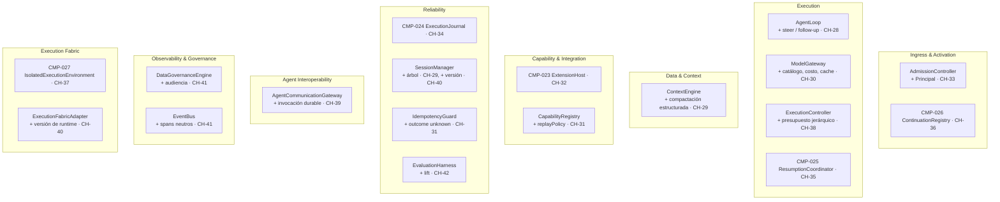

# Propuestas para book-harness — índice y hoja de ruta

[[BH-Propuesta-Lecciones-eve]] · [[BH-Propuesta-Aportes-pi]] · [[Eve-vs-BookHarness-vs-Pi]] · [[BH-Implementacion]] · [[BH-Arquitectura-y-Flujos]]

Diseño de **cómo** incorporar a *"¿Cómo construir un arnés?"* (`aaramirez/book-harness` @ `d16e2c7`):
- las **lecciones de eve** que le faltan: [[BH-Propuesta-Lecciones-eve]];
- lo que **pi** tiene y lo enriquecería: [[BH-Propuesta-Aportes-pi]].

> **Por qué vive aquí:** `repos/` es material de referencia de solo lectura en este vault. La propuesta se escribe en `docs/propuestas/book-harness/`, y **se aplicaría en el repositorio del libro** siguiendo su propio proceso (§5). Todo es **[inferencia]** de diseño, y los IDs son propuestos.

---

## 1. Principios de ubicación

Las propuestas respetan las reglas del propio libro:

| Regla del libro | Cómo se respeta |
| --- | --- |
| **P-09**: agente único antes que multi-agente | El tramo de pi (núcleo) va antes que el de eve. La invocación entre agentes (CH-39) es el único capítulo multi-agente y va casi al final. |
| **"No magic entities"** y ningún capítulo usa entidades posteriores | Los capítulos nuevos se **agregan después de CH-27**. Los contratos anteriores se amplían con `modifies_contracts` y `modified_by`, sin reescribir capítulos existentes. |
| **EVO-01**: mantener el núcleo pequeño | Solo **5 componentes nuevos** (de 22 a 27). El resto amplía componentes existentes. |
| **EVO-07**: justificar las dependencias | Cada componente nuevo incluye "por qué no le pertenece a uno existente". |
| **EVO-08**: un cambio que rompe un contrato requiere ADR | Cuatro ADRs (§4). Los campos nuevos son `Optional` o tienen default fail-closed. |
| **EVO-10**: las extensiones no pueden saltarse la constitución | ExtensionHost (CH-32) lo hace cumplir: ningún hook devuelve "autorizado". |

**Evidencia:**
- `repos/aaramirez/book-harness/constitution/ARCHITECTURE_CONSTITUTION.md:123-125` (P-09).
- `repos/aaramirez/book-harness/constitution/ARCHITECTURE_CONSTITUTION.md:723-773` (EVO-01..10).
- `repos/aaramirez/book-harness/registry/contracts.yaml:14-16` (regla de contratos futuros).
- `repos/aaramirez/book-harness/skills/write-pseudocode/SKILL.md:12-16` (no magic entities).

---

## 2. Dónde queda cada pieza en los planos

**Leyenda:** "CMP-0xx" es un componente **nuevo**; "+ …" es un componente **existente** que se amplía.

---

## 3. Hoja de ruta y asignación conjunta de IDs

IDs correlativos por orden de introducción, que es la regla del registro (nunca se reutiliza un id). Los actuales llegan a **CMP-022, C-035 y CH-27**.

| Capítulo | Título propuesto | Fuente | Componente | Contratos nuevos | Contratos modificados |
| --- | --- | --- | --- | --- | --- |
| **Tramo 4 — Enriquecer el núcleo de agente único** | | | | | |
| CH-28 | Entradas que llegan durante el turno: steering y follow-up | pi (+eve) | AgentLoop | C-036 PendingInput | — |
| CH-29 | Compactar sin perder el hilo: resúmenes estructurados y sesiones en árbol | pi (+eve) | ContextEngine, SessionManager | C-037 CompactionSummary, C-038 BranchSummary | C-020 SessionState v2 |
| CH-30 | El modelo como dato: catálogo, costo y cache | pi | ModelGateway | C-039 ModelDescriptor, C-040 UsageRecord | C-006 ModelRequest v2, C-007 ModelResponse v2 |
| CH-31 | Cuando no se sabe si ocurrió: política de replay | pi | CapabilityRegistry, IdempotencyGuard | C-041 ReplayPolicy | C-018 CapabilityDescriptor v2, C-009 ToolResult v2 |
| CH-32 | Extensiones que no pueden saltarse la constitución | pi | **CMP-023 ExtensionHost** | C-042 ExtensionRegistration, C-043 HookPoint, C-044 ResourceTrustDecision | — |
| **Tramo 5 — Operación durable** | | | | | |
| CH-33 | La identidad del llamante y el arranque que no admite nada | eve | AdmissionController | C-045 Principal, C-046 CallerSnapshot | C-004 ExecutionContext v2, C-023 AdmissionDecision v2 |
| CH-34 | Pasos durables y la recuperación a mitad de turno | eve (+pi) | **CMP-024 ExecutionJournal** | C-047 StepRecord, C-048 RecoveryDecision | — |
| CH-35 | Esperas durables y la reanudación desde cualquier canal | eve (+pi) | **CMP-025 ResumptionCoordinator** | C-049 ParkedWait, C-050 AuthorizationChallenge | C-015 HumanInteractionRequest v2, C-013 (se da uso a PAUSED) |
| CH-36 | Direcciones de continuación: cuándo un estímulo continúa y cuándo activa | eve | **CMP-026 ContinuationRegistry** | C-051 ContinuationAddress | C-022 ActivationRequest v2 |
| CH-37 | El entorno aislado y las credenciales que solo existen en el egress | eve | **CMP-027 IsolatedExecutionEnvironment**, CredentialBroker | C-052 SandboxSession, C-053 NetworkPolicy | — |
| CH-38 | Presupuestos que se heredan | eve | ExecutionController | C-054 ExecutionUsage (se promueve) | C-012 ExecutionBudget v2 |
| CH-39 | La invocación durable entre agentes | eve | AgentCommunicationGateway | C-055 AgentInvocation | C-024 AgentCommunicationMessage v2 |
| CH-40 | Evolucionar el runtime sin romper sesiones abiertas | eve (+pi) | SessionManager, ExecutionFabricAdapter | C-056 RuntimeVersionSnapshot | C-020 SessionState v3 |
| CH-41 | Observabilidad acotada por audiencia | eve + pi | DataGovernanceEngine, EventBus | C-057 SessionAudience, C-058 TraceCapturePolicy, C-059 TelemetrySpan | — |
| CH-42 | Medir el aporte de un cambio: evaluación con lift | pi | EvaluationHarness | C-060 LiftReport | C-032 EvaluationReport v2 |
| CH-43 | Integración: el turno durable gobernado (`runDurableGovernedTurn`) | eve + pi | función de integración | — | — |

**Totales:** 16 capítulos, 5 componentes (CMP-023..027), 25 contratos nuevos (C-036..060) y 14 modificaciones sobre 13 contratos existentes (C-020 cambia dos veces).

> CH-25 (epílogo de secuenciación) tendría que actualizarse para incluir los Tramos 4 y 5, igual que el libro ya lo hizo al agregar CH-26 y CH-27 después del epílogo (su frontmatter dice `next_chapter: CH-26`).

---

## 4. Borrador de Amendment v1.2 y ADRs

**Amendment v1.2 — Operación durable, identidad y extensibilidad** (continúa la numeración de `ARCHITECTURE_CONSTITUTION.md:926-1000`).

| Id | Enunciado propuesto | Capítulo |
| --- | --- | --- |
| P-31 | Identity travels with every turn | CH-33 |
| P-32 | A step is the unit of durability and recovery | CH-34 |
| P-33 | Waiting is durable and consumes no compute | CH-35 |
| P-34 | External conversations are addressed, not inferred | CH-36 |
| P-35 | Secrets never enter model-controlled compute | CH-37 |
| P-36 | The runtime may evolve under open sessions only at idle boundaries | CH-40 |
| P-37 | Observability capture is bounded by audience | CH-41 |
| INV-E15 | An unconfigured harness admits nothing, in any environment; development admission depends on process mode, never on the request | CH-33 |
| INV-E16 | A committed step is never re-executed during recovery | CH-34 |
| INV-E17 | An effect whose outcome is unknown is re-executed only if its capability declares `replayPolicy = SAFE` | CH-31 / CH-34 |
| INV-E18 | A delivery resumes only the wait it addresses, and only if its responder is authorized for it | CH-35 |
| INV-E19 | A continuation address has at most one owning session at a time | CH-36 |
| INV-E20 | Credentials are never materialized inside the isolated execution environment | CH-37 |
| INV-E21 | A child budget never exceeds its parent's remaining budget | CH-38 |
| INV-E22 | Live work (pending waits, uncommitted steps, active child runs) never migrates between runtime versions | CH-40 |
| INV-E23 | No trace destination may capture content above the session's capture ceiling | CH-41 |
| INV-E24 | No hook point may return an authorization outcome | CH-32 |

**ADRs** (formato mínimo del libro: `ARCHITECTURE_CONSTITUTION.md:867-884`; `docs/adr/` hoy está vacío):

| ADR | Decisión | Contratos | Estrategia de migración |
| --- | --- | --- | --- |
| ADR-001 | El principal verificado viaja en `ExecutionContext` | C-004 v2, C-023 v2 | Campo `Optional`: los capítulos 00–32 siguen válidos sin principal |
| ADR-002 | La capability declara su política de replay | C-018 v2, C-009 v2 | Default `NEVER` (fail-closed): toda capability existente se trata como no re-ejecutable |
| ADR-003 | La sesión es un árbol navegable con versión de runtime | C-020 v2 → v3 | `activeCheckpointId` y `runtimeVersion` opcionales; las sesiones sin versión se tratan como de la versión inicial |
| ADR-004 | El presupuesto es jerárquico | C-012 v2 | `parentRunId` opcional: un run raíz no cambia su semántica |

---

## 5. Cómo aplicarlo en el repositorio del libro

El libro tiene su **propio arnés de producción**. Estas propuestas deberían entrar por él, no como una edición directa:

1. **Planes.** Un archivo `planes/<fecha>-capitulo-NN-<slug>.md` por capítulo, como los existentes.
2. **Constitución.** book-architect *propone* el Amendment v1.2, y **una persona lo aprueba**. El agente propone pero nunca aprueba cambios fundamentales (`agents/book-architect.md:16-30`).
3. **Registros.** Fichas en `registry/components.yaml` (10 campos, incluido `does_not_own`), contratos en `registry/contracts.yaml` (con `version` y `modified_by`) y términos en `registry/glossary.yaml`.
4. **Brief y capítulo.** book-architect produce el Chapter Brief. chapter-author escribe con las skills `write-technical-chapter` (secciones obligatorias), `define-component`, `define-contract`, `write-pseudocode`, `analyze-constitutional-impact` y `design-retrieval-practice`.
5. **Validación.** `scripts/build-all` corre validate-contracts, validate-components, validate-chapter y validate-retrieval-set. Con `unresolved_validation_errors: deny`, cualquier falla detiene la publicación.
6. **ADRs** en `docs/adr/`, antes del capítulo que modifica cada contrato.
7. **Diagramas.** Un Archify por capítulo, siguiendo la convención `diagrams/archify/capitulo-NN-*.json`, y actualizar `nucleo-del-arnes` / `capa-enterprise`. Opcionalmente, un set de estudio en este vault con el skill `estudio-visual`.
8. **Epílogo y KB.** Actualizar CH-25 (orden y P-09) y `kb/` (componentes, contratos, capítulos).

**Evidencia:**
- `repos/aaramirez/book-harness/scripts/build-all:41-80`
- `repos/aaramirez/book-harness/policies/publishing.yaml:13-14`
- `repos/aaramirez/book-harness/registry/components.yaml:1-20`
- `repos/aaramirez/book-harness/registry/contracts.yaml:1-20`

---

## 6. Priorización sugerida

| Prioridad | Capítulos | Por qué |
| --- | --- | --- |
| **Imprescindible** | CH-31 (replay), CH-33 (identidad), CH-34 (pasos durables), CH-35 (esperas durables) | Cierran huecos que el propio libro declara: P-23 sin mecanismo, `resumeAfterHumanResolution` sin cablear, `PAUSED` sin uso, identidad sin contrato. |
| **Muy recomendable** | CH-28 (steering), CH-29 (compactación y árbol), CH-36 (continuación), CH-37 (entorno aislado) | Hacen el núcleo realista y cierran la brecha entre "credencial fuera del contexto" y "secreto fuera del cómputo". |
| **Recomendable** | CH-30 (modelo como dato), CH-32 (ExtensionHost), CH-38 (presupuesto), CH-41 (audiencia y spans), CH-43 (integración) | Enriquecen la observabilidad, el costo y la extensibilidad, y cierran el tramo con una integración. |
| **Opcional** | CH-39 (invocación entre agentes), CH-40 (evolución del runtime), CH-42 (lift) | Son valiosas pero más avanzadas. CH-39 es multi-agente (P-09 y EVO-02 piden prudencia). |

---

## 7. Riesgos de la propuesta

- **El libro crece mucho.** Pasaría de 28 a 44 capítulos. Mitigación: aplicar solo "Imprescindible" y "Muy recomendable" (8 capítulos) como Tramo 4, y dejar el resto para una v0.2 del libro.
- **La tentación de copiar a eve.** El libro enseña **arquitectura independiente de la plataforma** (P-27). Todo lo que en eve depende de Vercel (Workflow, Sandbox, Connect) aquí queda como adaptador o como contrato.
- **Coherencia de las funciones de integración.** CH-12, CH-26 y CH-27 no invocan los caminos de CH-13. CH-43 debería ser la primera integración que **sí** cablea las esperas, la recuperación y la continuación, y documentarlo como tal.

---

[[BH-Propuesta-Lecciones-eve]] · [[BH-Propuesta-Aportes-pi]] · [[Eve-vs-BookHarness-vs-Pi]] · [[Home]]
