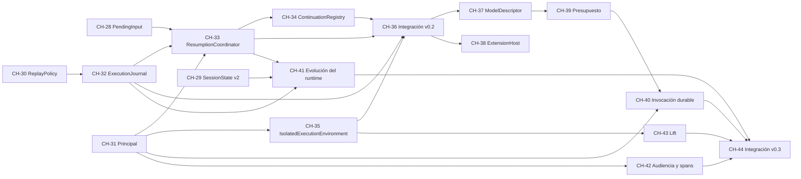

# Actualización de book-harness con las lecciones de eve y los aportes de pi

> **Reemplazado (2026-09-24)** por el plan ejecutable en el repo del libro: `C:UsersHomeDocumentsPook-harnessplanes‚6-09-24-extension-v0-2-v0-3-eve-pi-conexiones.md`. Ese plan agrega los capítulos de conexiones MCP/OpenAPI, datos, A2A y autoría (CH-28..CH-47), la línea base verificada y el entorno instalado.

## Objective

Aplicar al libro **"¿Cómo construir un arnés?"** (`aaramirez/book-harness`, @ `d16e2c7`) el diseño de `docs/propuestas/book-harness/BH-Propuestas.md`:
- las lecciones de eve (`docs/propuestas/book-harness/BH-Propuesta-Lecciones-eve.md`);
- los aportes de pi (`docs/propuestas/book-harness/BH-Propuesta-Aportes-pi.md`).

Se hace en **dos releases del libro (v0.2 y v0.3)**, cada una formada por incrementos de un capítulo. Cada incremento pasa por el arnés de producción del propio libro (validadores, BookIR, web, PDF, mapa mental) sin romper CH-00..CH-27.

Este plan vive en `arnes-ai` porque aquí se diseñó. El trabajo se ejecuta **en el repo del libro**, y cada incremento abre su propio plan en `book-harness/planes/`, con la convención existente (`AAAA-MM-DD-capitulo-NN-<slug>.md`).

## Requirements

1. Trabajar en un clon **escribible** de `aaramirez/book-harness`, no en `arnes-ai/repos/` (solo lectura). Rama por incremento y PR por incremento. — priority: high
2. **Fase 0 antes de cualquier capítulo:** ratificar el Amendment v1.2 con aprobación humana, crear ADR-001..004 en estado `Proposed` y verificar los validadores ante contratos modificados. — priority: high
3. Respetar el orden **P-09**: los incrementos de agente único van antes que el único incremento multi-agente (invocación durable). — priority: high
4. Cada capítulo sigue la estructura obligatoria (`write-technical-chapter`): frontmatter con `introduces_*`, `modifies_contracts`, `constitutional_articles`, `retrieval_set`, y secciones 0–21. — priority: high
5. Toda entidad nueva se registra **antes** de usarse ("no magic entities"). Los contratos modificados suman el capítulo en `modified_by` y suben `version`. — priority: high
6. Ningún capítulo existente se reescribe. Solo se ajustan el `next_chapter` de CH-27 (hoy `null`), el epílogo CH-25 (orden y P-09) y los diagramas generales. — priority: high
7. `scripts/build-all` debe terminar sin errores en cada incremento (`publishing.yaml`: `unresolved_validation_errors: deny`). — priority: high
8. Un diagrama Archify por capítulo (`diagrams/archify/capitulo-NN-*.json` + `rendered/`), y actualizar `nucleo-del-arnes` / `capa-enterprise` al cierre de cada release. — priority: medium
9. Actualizar `kb/`: fichas CMP / C / CH, glosario e índice con los conteos. — priority: medium
10. El libro sigue independiente de la plataforma (P-27): nada de Vercel, pi-ai ni SDKs en el pseudocódigo. Todo lo externo queda como adaptador o como punto de extensión declarado. — priority: high

## Architecture

### Where the work lives
- **Repo destino:** `aaramirez/book-harness` (clon de trabajo propio).
- **Fuente del diseño:** `arnes-ai/docs/propuestas/book-harness/`.
- **Seguimiento:** este plan, más un `planes/` por incremento en el libro.

### Releases y orden definitivo de capítulos

La propuesta numeró CH-28..43 en orden temático. Para poder **publicar primero lo imprescindible y lo muy recomendable**, el plan reordena en dos releases. Como los IDs se asignan en orden de introducción, **se renumeran** CH / CMP / C. Los principios e invariantes **no cambian**: el Amendment v1.2 se ratifica completo en la Fase 0.

**Release v0.2 — "Núcleo robusto y operación durable"** (8 capítulos + 1 de integración):

| Capítulo | Título | Propuesta | Componente | Contratos nuevos | Contratos modificados | Artículos |
| --- | --- | --- | --- | --- | --- | --- |
| CH-28 | Entradas que llegan durante el turno: steering y follow-up | pi P-A1 | AgentLoop | C-036 PendingInput | — | P-10, INV-08, INV-10 |
| CH-29 | Compactar sin perder el hilo: resúmenes estructurados y sesiones en árbol | pi P-A2/A3 | ContextEngine, SessionManager | C-037 CompactionSummary, C-038 BranchSummary | C-020 SessionState v2 (ADR-003) | P-08, P-14, EVO-09 |
| CH-30 | Cuando no se sabe si ocurrió: política de replay | pi P-A5 | CapabilityRegistry, IdempotencyGuard | C-039 ReplayPolicy | C-018 v2 (ADR-002), C-009 v2 | P-24, INV-11, INV-E17 |
| CH-31 | La identidad del llamante y el arranque que no admite nada | eve E1 | AdmissionController | C-040 Principal, C-041 CallerSnapshot | C-004 v2 (ADR-001), C-023 v2 | P-31, INV-E15 |
| CH-32 | Pasos durables y la recuperación a mitad de turno | eve E2 + pi P-A10 | **CMP-023 ExecutionJournal** | C-042 StepRecord, C-043 RecoveryDecision | — | P-32, INV-E16, INV-E17 |
| CH-33 | Esperas durables y la reanudación desde cualquier canal | eve E3 + pi P-A8 | **CMP-024 ResumptionCoordinator** | C-044 ParkedWait, C-045 AuthorizationChallenge | C-015 v2, C-013 (uso de PAUSED) | P-33, INV-E18 |
| CH-34 | Direcciones de continuación: cuándo un estímulo continúa y cuándo activa | eve E4 | **CMP-025 ContinuationRegistry** | C-046 ContinuationAddress | C-022 v2 | P-34, INV-E19 |
| CH-35 | El entorno aislado y las credenciales que solo existen en el egress | eve E5 | **CMP-026 IsolatedExecutionEnvironment**, CredentialBroker | C-047 SandboxSession, C-048 NetworkPolicy | — | P-35, INV-E20 |
| CH-36 | Integración: el turno durable gobernado (`runDurableGovernedTurn`) | eve + pi | función de integración | — | — | todos los anteriores |

**Release v0.3 — "Ecosistema, escala y evolución"** (7 capítulos + 1 de integración):

| Capítulo | Título | Propuesta | Componente | Contratos nuevos | Contratos modificados |
| --- | --- | --- | --- | --- | --- |
| CH-37 | El modelo como dato: catálogo, costo y cache | pi P-A4 | ModelGateway | C-049 ModelDescriptor, C-050 UsageRecord | C-006 v2, C-007 v2 |
| CH-38 | Extensiones que no pueden saltarse la constitución | pi P-A6 | **CMP-027 ExtensionHost** | C-051 ExtensionRegistration, C-052 HookPoint, C-053 ResourceTrustDecision | — |
| CH-39 | Presupuestos que se heredan | eve E6 | ExecutionController | C-054 ExecutionUsage (se promueve) | C-012 v2 (ADR-004) |
| CH-40 | La invocación durable entre agentes (único multi-agente) | eve E7 | AgentCommunicationGateway | C-055 AgentInvocation | C-024 v2 |
| CH-41 | Evolucionar el runtime sin romper sesiones abiertas | eve E8 + pi P-A11 | SessionManager, ExecutionFabricAdapter | C-056 RuntimeVersionSnapshot | C-020 v3 (ADR-003) |
| CH-42 | Observabilidad acotada por audiencia | eve E9 + pi P-A7 | DataGovernanceEngine, EventBus | C-057 SessionAudience, C-058 TraceCapturePolicy, C-059 TelemetrySpan | — |
| CH-43 | Medir el aporte de un cambio: evaluación con lift | pi P-A9 | EvaluationHarness | C-060 LiftReport | C-032 v2 |
| CH-44 | Integración: el turno durable gobernado, completo | eve + pi | función de integración | — | — |

**Mapa de renumeración** (de la propuesta al plan), solo para lo que cambia:

| En la propuesta | En el plan |
| --- | --- |
| CH-31 → CH-33 → CH-34 → CH-35 → CH-36 → CH-37 | CH-30 → CH-31 → CH-32 → CH-33 → CH-34 → CH-35 |
| CH-30, CH-32 (modelo, ExtensionHost) | CH-37, CH-38 |
| CH-38 → CH-43 | CH-39 → CH-44 (se agrega una integración parcial CH-36 en v0.2) |
| CMP-023 ExtensionHost | CMP-027 |
| CMP-024..027 | CMP-023..026 |
| C-039..044 (pi: modelo, ExtensionHost) | C-049..053 |
| C-041 ReplayPolicy | C-039 |
| C-045..053 | C-040..048 |

### Files to create (en `book-harness/`)

- **Fase 0:**
  - `docs/adr/ADR-001-principal-en-execution-context.md`
  - `docs/adr/ADR-002-replay-policy-en-capability.md`
  - `docs/adr/ADR-003-sesion-en-arbol-y-version-de-runtime.md`
  - `docs/adr/ADR-004-presupuesto-jerarquico.md`

  Cada uno con el formato mínimo del libro: ADR-ID, Title, Status, Context, Decision, Alternatives, Consequences, Constitutional Articles Affected, Migration Strategy.
- **Fase 0:** `planes/2026-MM-DD-amendment-v1-2.md`, que registra la decisión y la aprobación humana del amendment.
- **Por capítulo NN:**
  - `planes/2026-MM-DD-capitulo-NN-<slug>.md`
  - `book/chapters/NN-<slug>/chapter.md`
  - `diagrams/archify/capitulo-NN-<slug>.json` + `diagrams/archify/rendered/capitulo-NN-<slug>.html`
  - `kb/04-Capitulos/CH-NN.md`
  - `kb/02-Componentes/CMP-0xx.md` (si introduce componente)
  - `kb/03-Contratos/C-0xx.md` (por cada contrato nuevo)
- **Generados por el pipeline** (se commitean como fuente): `diagrams/mindmap/chapter-NN.diagram` y `full-book.diagram`.

### Files to modify (en `book-harness/`)

- **Una vez, en la Fase 0:** `constitution/ARCHITECTURE_CONSTITUTION.md`. Agrega "Amendment v1.2 — Durable Operation, Identity and Extensibility" con P-31..P-37 e INV-E15..INV-E24, sin tocar P-01..P-30.
- **Por capítulo:**
  - `book/book.yaml`: agregar el capítulo al final.
  - `registry/components.yaml`: ficha de 10 campos, con `does_not_own` citando componentes ya registrados.
  - `registry/contracts.yaml`: contratos nuevos. En los modificados, subir `version`, reemplazar `current_definition` y sumar el capítulo en `modified_by`.
  - `registry/glossary.yaml`: términos en español con el término en inglés.
  - el `next_chapter` del capítulo anterior.
- **Al cierre de cada release:**
  - `book/chapters/25-epilogo-secuenciacion/chapter.md`: orden y P-09. Aprovechar para corregir la inconsistencia `next_chapter: CH-26` frente a §19 "el último".
  - `diagrams/archify/nucleo-del-arnes.json` y `capa-enterprise.json`.
  - `kb/Index.md`: conteos de componentes, contratos, capítulos y términos.
  - `book/book.yaml`: `version: "0.2"` / `"0.3"`.
- **Opcional, incremento aparte:** corregir las inconsistencias encontradas en el estudio:
  - `registry/components.yaml:101` frente a `ch25:331-342` (plano de CredentialBroker);
  - `registry/glossary.yaml:1200-1202` (EvaluationHarness fuera de los 9 planos);
  - `kb/07-Diagramas/Diagramas.md` (habla de `.archify`, pero las fuentes son `.json`).

### Decisions

- **Dos releases en lugar de 16 capítulos seguidos.** v0.2 entrega lo que el libro declara y no resuelve: P-23 sin mecanismo, `resumeAfterHumanResolution` sin cablear, `PAUSED` sin uso, identidad sin contrato. v0.3 es crecimiento.
- **El Amendment v1.2 se ratifica completo al inicio.** Así P/INV no se renumeran aunque cambie el orden de los capítulos. Es el mismo patrón del libro: la constitución es la semilla, y Amendment v1.1 existía antes de CH-14.
- **Cada release cierra con un capítulo de integración** (CH-36, CH-44), como CH-12/13 y CH-26/27. CH-36 es la **primera** integración que sí cablea los caminos alternativos (esperas, recuperación, continuación), y debe decirlo explícitamente.
- **Los campos nuevos de contratos existentes son `Optional` o tienen default fail-closed** (`replayPolicy = NEVER`). Así ningún pseudocódigo de CH-00..CH-27 se invalida. Igual hay ADR por cambio semántico (EVO-08).
- **Los adaptadores quedan fuera del registro:** verificador de identidad, MCP / A2A, transporte de UI remota, fuente de schedules. Siguen el patrón del Ingress Adapter (P-16).

### Execution order (fases)

1. **Fase 0 — Preparación** (sin capítulos):
   - **Spike de validadores:** en una rama desechable, modificar un contrato (p.ej. C-004 v2 con un campo `Optional<X>`, donde X es un contrato de un capítulo posterior) y correr `build-all`. Hay que confirmar tres cosas:
     - (a) `validate-chapter` acepta `modifies_contracts`;
     - (b) `validate-contracts` acepta `version: v2` y `modified_by`;
     - (c) **los capítulos antiguos que usan C-004 no fallan** por la regla de "entidades futuras", ya que el registro guarda solo la definición vigente.

     Si (c) falla, se agrega a los validadores el soporte de "definición por versión" antes de seguir, en un plan propio.
   - Borradores de ADR-001..004 en estado `Proposed`.
   - Amendment v1.2 propuesto por book-architect y **aprobado por una persona** (no lo aprueba el agente: `agents/book-architect.md:16-30`).
2. **Fase 1 — Release v0.2:** CH-28 → CH-36, un incremento por capítulo, en orden estricto. Cada uno cumple los 7 pasos del TDD Flow. Al terminar CH-36: actualizar CH-25, los diagramas generales, `kb/Index.md` y `version: "0.2"`. Luego `build-all` completo y tag `v0.2`.
3. **Fase 2 — Release v0.3:** CH-37 → CH-44, mismo procedimiento. CH-40 (multi-agente) no empieza hasta que CH-37..CH-39 pasen. Tag `v0.3`.
4. **Fase 3 — Opcional:** corregir las inconsistencias previas; estudio visual en `arnes-ai` con el skill `estudio-visual` para los capítulos nuevos.

### Dependencias entre capítulos (lo que obliga al orden)

## TDD Flow

En el libro, los "tests" son sus validadores. Cada incremento sigue **registro primero, capítulo después**:

1. **Plan del incremento** en `planes/` (alcance cerrado: exactamente qué componentes y contratos). Lo revisa book-architect, que produce el **Chapter Brief**.
2. **Rojo:** agregar el capítulo a `book/book.yaml` con un `chapter.md` que solo tiene frontmatter. Correr `scripts/validate-chapter`: **debe fallar** por secciones faltantes y por entidades no registradas.
3. **Registro:** fichas en `components.yaml` / `contracts.yaml` / `glossary.yaml` (`define-component`, `define-contract`). `validate-components` y `validate-contracts` en verde.
4. **Capítulo:** chapter-author escribe las secciones 0–21 con `write-technical-chapter`, `write-pseudocode` (sin entidades mágicas), `analyze-constitutional-impact` (§4 y §17) y `design-retrieval-practice` (`retrieval_set`).
5. **Verde:** `validate-chapter` y `validate-retrieval-set` en verde.
6. **Pipeline:** `scripts/build-all` sin errores (IR, mapa mental, web y PDF).
7. **Diagrama:** Archify del capítulo con `validate --quality showcase` (9/9, 0 errores, 0 warnings) → `deliver` → `visual-check`.

## Verification

- `scripts/build-all` termina en 0 y `dist/book-state.json` no queda en `failed_validation`, en cada incremento y al cierre de cada release.
- `grep` del pseudocódigo de cada capítulo nuevo: ninguna entidad sin registro previo; ningún SDK ni plataforma (Vercel, pi-ai, OpenAI…); ningún nombre de componente posterior.
- Por cada contrato modificado:
  - `version` subió;
  - `modified_by` incluye el capítulo;
  - hay un ADR `Accepted` si su semántica cambió;
  - los capítulos CH-00..CH-27 siguen en verde.
- CH-36 y CH-44 llaman **de verdad** a los caminos alternativos: `resumeAfterHumanResolution`, `recoverRun` y la entrega por dirección de continuación.
- Checklist por release, contra las invariantes nuevas: cada una de INV-E15..E24 tiene al menos un test del capítulo que la introduce (sección 16, "Tests").
- En `arnes-ai`: actualizar `docs/propuestas/book-harness/BH-Propuestas.md` con el estado ("aplicado en vX") y, si se hace el estudio visual, pasar `archify-check.js` 100 %.

## Notas

- **Riesgo principal: validadores sin historia de versiones.** El registro guarda una sola `current_definition` por contrato, y nunca se modificó un contrato (`modified_by: []` en los 35). El spike de la Fase 0 es obligatorio.
- **Riesgo de alcance:** 17 capítulos nuevos casi duplican el libro. Si hace falta recortar, v0.2 es autosuficiente; v0.3 puede quedar como "Parte III" futura.
- **Riesgo de copiar plataformas:** revisar en cada Brief que el capítulo enseña un contrato o un principio, no el producto de eve o de pi (P-27, EVO-01).
- **Decisión pendiente para ti:**
  - ¿Se hace el reordenamiento en dos releases (este plan) o se mantiene el orden temático de la propuesta en una sola entrega?
  - ¿La versión del libro sube a 0.2 / 0.3, o se mantiene 0.1 con capítulos nuevos?
- **Referencias:**
  - `repos/aaramirez/book-harness/scripts/validate-chapter:151-178`
  - `repos/aaramirez/book-harness/scripts/validate-contracts:11-52`
  - `repos/aaramirez/book-harness/book/book.yaml:10-14`
  - `repos/aaramirez/book-harness/book/chapters/27-integracion-enterprise-caminos-de-control/chapter.md` (frontmatter, `next_chapter: null`)
  - `repos/aaramirez/book-harness/planes/2026-09-17-capitulo-17-idempotency-guard.md` (formato de plan por incremento)
